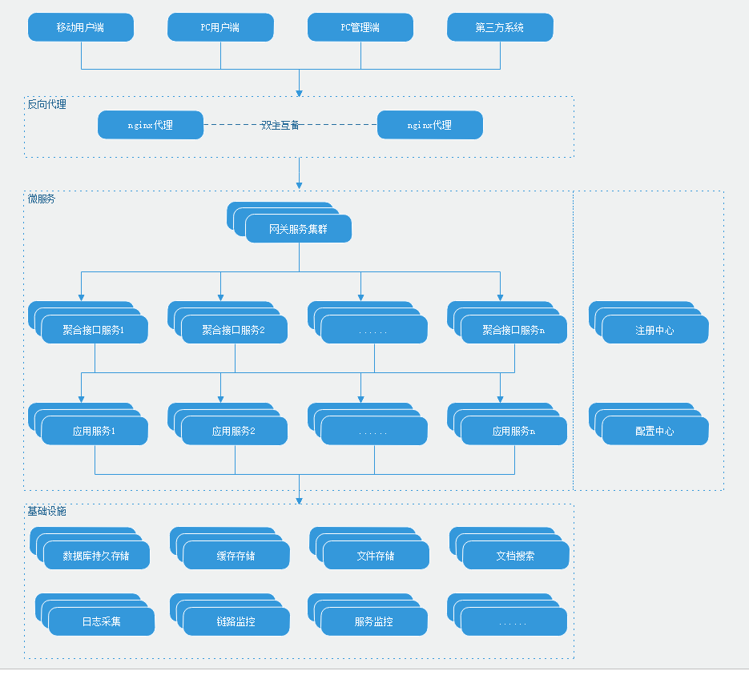

# 微服务分层设计

  * 通常微服务分层架构如下(描述省略了一些基础设施中间件)：

    

  * 反向代理

        流量的统一入口，配置 https 证书，对外发布网关服务、服务资源监控后台、服务链路监控后台、注册中心后台、配置中心后台等

        对并发要求不高的集群，还可以作为前端静态资源的代理服务器、文件代理服务器

  * 网关服务

        所有业务请求入口，可以进行日志埋点、灰度控制、登录验证、权限验证等

  * 聚合接口服务

        接口请求参数验证，更细粒度的权限控制，聚合下层服务，剔除不应该暴露的接口字段，用户登录态在此层结束

  * 业务服务

        业务规则的具体实现，使用领域建模划分为不同的服务，提供粒度合理的可复用的服务

  * 基础设施

        微服务依赖的中间件，如数据库、消息中间件等。一般只有业务服务允许进行访问，特殊情况例如网关可以接入MQ进行数据交换
