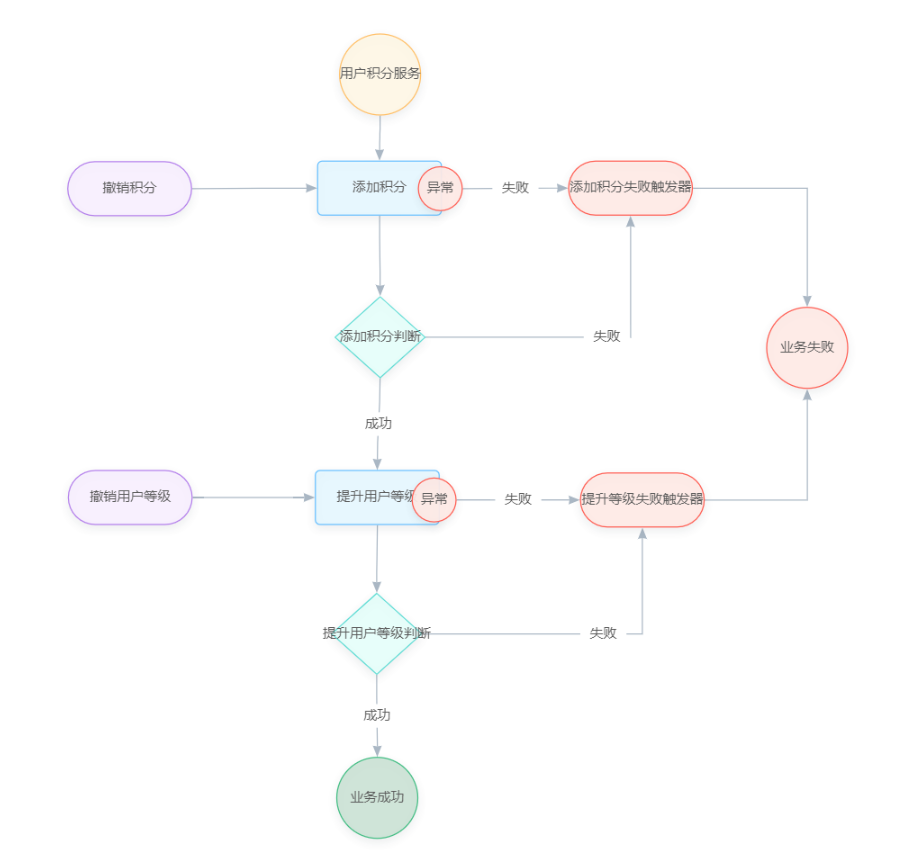

# 分布式事务 seata saga模式

  * 简单介绍

        Saga模式是SEATA提供的长事务解决方案，在Saga模式中，业务流程中每个参与者都提交本地事务，当出现某一个参与者失败则补偿前面已经成功的参与者，一阶段正向服务和二阶段补偿服务都由业务开发实现。

        适用业务流程长、业务流程多、参与者包含其它公司或遗留系统服务，无法提供 TCC 模式要求的三个接口

  * 官方文档地址：

        https://seata.io/zh-cn/docs/overview/what-is-seata.html

        https://github.com/seata/seata/blob/develop/script/client/saga/db/mysql.sql

  * 示例源码地址：

        https://github.com/zfhlm/mrh-example/tree/main/mrh-spring-boot

### 创建普通服务

  * 引入 maven 依赖：

        <dependency>
            <groupId>org.springframework.boot</groupId>
            <artifactId>spring-boot-starter-jdbc</artifactId>
        </dependency>
        <dependency>
            <groupId>org.mybatis.spring.boot</groupId>
            <artifactId>mybatis-spring-boot-starter</artifactId>
        </dependency>
        <dependency>
            <groupId>mysql</groupId>
            <artifactId>mysql-connector-java</artifactId>
        </dependency>

  * 创建启动类：

        @SpringBootApplication
        @ComponentScan(basePackageClasses=Application.class)
        @EnableTransactionManagement
        @MapperScan(basePackageClasses=TIntegralMapper.class)
        public class Application {

            public static void main(String[] args) {
                SpringApplication.run(Application.class, args);
            }

        }

  * 添加 application.yml 配置：

        spring:
          profiles:
            active: default
          application:
            name: mrh-spring-boot-transaction-seata-saga-integral
          datasource:
            type: org.apache.commons.dbcp2.BasicDataSource
            url: 'jdbc:mysql://192.168.140.130:3306/integral?useUnicode=true&characterEncoding=UTF-8&serverTimezone=GMT%2B8'
            username: root
            password: 123456
            driver-class-name: com.mysql.cj.jdbc.Driver
            dbcp2:
              max-active: 1000
              initial-size: 1
              max-idle: 50
              max-wait: 60000
              validation-query: select 1
              test-while-idle: true
              test-on-borrow: false
              time-between-eviction-runs-millis: 60000
              min-evictable-idle-time-millis: 1800000
              remove-abandoned: true
              remove-abandoned-timeout: 180

        mybatis:
          mapper-locations: classpath:org/lushen/mrh/boot/seata/at/dao/mapping/*.xml
          type-aliases-package: org.lushen.mrh.boot.seata.at.dao.model
          type-handlers-package: org.lushen.mrh.boot.seata.at.dao.handler

  * 添加测试接口：

        @RestController
        public class TestController {

            @Autowired
            private TIntegralMapper integralMapper;

            @Transactional
            @RequestMapping(path="add")
            public String add() {

                TIntegral integral = new TIntegral();
                integral.setId(ThreadLocalRandom.current().nextInt(Integer.MAX_VALUE));
                integral.setName(UUID.randomUUID().toString());
                integralMapper.insert(integral);

                System.out.println("add :: " + integral.getId());

                return String.valueOf(integral.getId());
            }

            @Transactional
            @RequestMapping(path="del/{id}")
            public String del(@PathVariable(name="id", required=true) Integer id) {

                integralMapper.deleteByPrimaryKey(id);

                System.out.println("del :: " + id);

                return String.valueOf(id);
            }

        }

### 创建 seata saga 服务

  * 添加 maven 依赖：

        <dependency>
            <groupId>org.springframework.boot</groupId>
            <artifactId>spring-boot-starter-jdbc</artifactId>
        </dependency>

        <!-- mybatis -->
        <dependency>
            <groupId>org.mybatis.spring.boot</groupId>
            <artifactId>mybatis-spring-boot-starter</artifactId>
        </dependency>

        <!-- mysql -->
        <dependency>
            <groupId>mysql</groupId>
            <artifactId>mysql-connector-java</artifactId>
        </dependency>

        <!-- seata -->
        <dependency>
            <groupId>io.seata</groupId>
            <artifactId>seata-spring-boot-starter</artifactId>
        </dependency>
        <dependency>
            <groupId>com.alibaba.nacos</groupId>
            <artifactId>nacos-client</artifactId>
        </dependency>
        <dependency>
            <groupId>com.alibaba.nacos</groupId>
            <artifactId>nacos-api</artifactId>
        </dependency>

  * 创建启动类：

        @SpringBootApplication
        @ComponentScan(basePackageClasses=Application.class)
        @EnableTransactionManagement
        @MapperScan(basePackageClasses=TUserMapper.class)
        public class Application {

            public static void main(String[] args) {
                SpringApplication.run(Application.class, args);
            }

        }

  * 添加 application.yml 配置：

        spring:
          profiles:
            active: nacos
          application:
            name: mrh-spring-boot-transaction-seata-saga-user
          datasource:
            type: org.apache.commons.dbcp2.BasicDataSource
            url: 'jdbc:mysql://192.168.140.130:3306/user?useUnicode=true&characterEncoding=UTF-8&serverTimezone=GMT%2B8'
            username: root
            password: 123456
            driver-class-name: com.mysql.cj.jdbc.Driver
            dbcp2:
              max-active: 1000
              initial-size: 1
              max-idle: 50
              max-wait: 60000
              validation-query: select 1
              test-while-idle: true
              test-on-borrow: false
              time-between-eviction-runs-millis: 60000
              min-evictable-idle-time-millis: 1800000
              remove-abandoned: true
              remove-abandoned-timeout: 180

        mybatis:
          mapper-locations: classpath:org/lushen/mrh/boot/seata/at/dao/mapping/*.xml
          type-aliases-package: org.lushen.mrh.boot.seata.at.dao.model
          type-handlers-package: org.lushen.mrh.boot.seata.at.dao.handler

        seata:
          enabled: true
          enable-auto-data-source-proxy: false
          application-id: mrh-seata-saga-user
          tx-service-group: default_tx_group
          service:
            vgroup-mapping:
              default_tx_group: default
          client:
            rm-report-retry-count: 5
            rm-async-commit-buffer-limit: 10000
            tm-commit-retry-count: 5
            tm-rollback-retry-count: 20
          registry:
            type: nacos
            nacos:
              server-addr: 192.168.140.130:8848
              application: seata-server
              group: DEFAULT_GROUP
              username: nacos
              password: nacos

  * 创建 本地事务控制、mybatis 相关配置 bean：

        @Configuration
        public class TransactionConfiguration {

            // 本地数据源
            @Bean
            @ConfigurationProperties("spring.datasource.dbcp2")
            public BasicDataSource basicDataSource(DataSourceProperties properties) {
                return (BasicDataSource) properties.initializeDataSourceBuilder().build();
            }

            // 本地事务管理器
            @Bean
            public DataSourceTransactionManager dataSourceTransactionManager(BasicDataSource dataSource) {
                return new DataSourceTransactionManager(dataSource);
            }

            // 本地事务拦截器
            @Bean
            public TransactionInterceptor txAdvice(TransactionManager txManager){
                // 事务规则定义，所有异常都进行回滚
                List<RollbackRuleAttribute> rollbackRules = Collections.singletonList(new RollbackRuleAttribute(Throwable.class));
                TransactionAttribute transactionAttribute = new RuleBasedTransactionAttribute(TransactionDefinition.PROPAGATION_REQUIRED, rollbackRules);
                // 初始化事务拦截器
                MatchAlwaysTransactionAttributeSource transactionAttributeSource = new MatchAlwaysTransactionAttributeSource();
                transactionAttributeSource.setTransactionAttribute(transactionAttribute);
                return new TransactionInterceptor(txManager, transactionAttributeSource) ;
            }

            // 本地事务切面
            @Bean
            public PointcutAdvisor txPointcutAdvisor(TransactionInterceptor txAdvice){
                DefaultPointcutAdvisor advisor = new DefaultPointcutAdvisor();
                advisor.setAdvice(txAdvice);
                advisor.setPointcut(new Pointcut() {
                    @Override
                    public MethodMatcher getMethodMatcher() {
                        // 数据库事务生效切面，所有包含{@link Transactional}注解的方法
                        return new AnnotationMethodMatcher(Transactional.class);
                    }
                    @Override
                    public ClassFilter getClassFilter() {
                        return ClassFilter.TRUE;
                    }
                });
                return advisor;
            }

        }

  * 添加业务数据库 saga 相关表：

        // https://github.com/seata/seata/blob/develop/script/client/saga/db/mysql.sql

        -- -------------------------------- The script used for sage  --------------------------------
        CREATE TABLE IF NOT EXISTS `seata_state_machine_def`
        (
            `id`               VARCHAR(32)  NOT NULL COMMENT 'id',
            `name`             VARCHAR(128) NOT NULL COMMENT 'name',
            `tenant_id`        VARCHAR(32)  NOT NULL COMMENT 'tenant id',
            `app_name`         VARCHAR(32)  NOT NULL COMMENT 'application name',
            `type`             VARCHAR(20)  COMMENT 'state language type',
            `comment_`         VARCHAR(255) COMMENT 'comment',
            `ver`              VARCHAR(16)  NOT NULL COMMENT 'version',
            `gmt_create`       DATETIME(3)  NOT NULL COMMENT 'create time',
            `status`           VARCHAR(2)   NOT NULL COMMENT 'status(AC:active|IN:inactive)',
            `content`          TEXT COMMENT 'content',
            `recover_strategy` VARCHAR(16) COMMENT 'transaction recover strategy(compensate|retry)',
            PRIMARY KEY (`id`)
        ) ENGINE = InnoDB
          DEFAULT CHARSET = utf8mb4;

        CREATE TABLE IF NOT EXISTS `seata_state_machine_inst`
        (
            `id`                  VARCHAR(128)            NOT NULL COMMENT 'id',
            `machine_id`          VARCHAR(32)             NOT NULL COMMENT 'state machine definition id',
            `tenant_id`           VARCHAR(32)             NOT NULL COMMENT 'tenant id',
            `parent_id`           VARCHAR(128) COMMENT 'parent id',
            `gmt_started`         DATETIME(3)             NOT NULL COMMENT 'start time',
            `business_key`        VARCHAR(48) COMMENT 'business key',
            `start_params`        TEXT COMMENT 'start parameters',
            `gmt_end`             DATETIME(3) COMMENT 'end time',
            `excep`               BLOB COMMENT 'exception',
            `end_params`          TEXT COMMENT 'end parameters',
            `status`              VARCHAR(2) COMMENT 'status(SU succeed|FA failed|UN unknown|SK skipped|RU running)',
            `compensation_status` VARCHAR(2) COMMENT 'compensation status(SU succeed|FA failed|UN unknown|SK skipped|RU running)',
            `is_running`          TINYINT(1) COMMENT 'is running(0 no|1 yes)',
            `gmt_updated`         DATETIME(3) NOT NULL,
            PRIMARY KEY (`id`),
            UNIQUE KEY `unikey_buz_tenant` (`business_key`, `tenant_id`)
        ) ENGINE = InnoDB
          DEFAULT CHARSET = utf8mb4;

        CREATE TABLE IF NOT EXISTS `seata_state_inst`
        (
            `id`                       VARCHAR(48)  NOT NULL COMMENT 'id',
            `machine_inst_id`          VARCHAR(128) NOT NULL COMMENT 'state machine instance id',
            `name`                     VARCHAR(128) NOT NULL COMMENT 'state name',
            `type`                     VARCHAR(20)  COMMENT 'state type',
            `service_name`             VARCHAR(128) COMMENT 'service name',
            `service_method`           VARCHAR(128) COMMENT 'method name',
            `service_type`             VARCHAR(16) COMMENT 'service type',
            `business_key`             VARCHAR(48) COMMENT 'business key',
            `state_id_compensated_for` VARCHAR(50) COMMENT 'state compensated for',
            `state_id_retried_for`     VARCHAR(50) COMMENT 'state retried for',
            `gmt_started`              DATETIME(3)  NOT NULL COMMENT 'start time',
            `is_for_update`            TINYINT(1) COMMENT 'is service for update',
            `input_params`             TEXT COMMENT 'input parameters',
            `output_params`            TEXT COMMENT 'output parameters',
            `status`                   VARCHAR(2)   NOT NULL COMMENT 'status(SU succeed|FA failed|UN unknown|SK skipped|RU running)',
            `excep`                    BLOB COMMENT 'exception',
            `gmt_updated`              DATETIME(3) COMMENT 'update time',
            `gmt_end`                  DATETIME(3) COMMENT 'end time',
            PRIMARY KEY (`id`, `machine_inst_id`)
        ) ENGINE = InnoDB
          DEFAULT CHARSET = utf8mb4;

  * 创建 saga 事务 使用的两个 service，分别调用远程接口、本地持久化接口：

        /**
         * 积分服务
         *
         * @author hlm
         */
        @Service("integralService")
        public class IntegralService {

            private RestTemplate template = new RestTemplate();

            /**
             * 增加积分，调用 http  接口
             *
             * @param quantity
             * @return
             */
            public Integer add(Integer quantity) {

                System.out.println("add integral :: quantity = " + quantity);

                ResponseEntity<String> res = template.getForEntity("http://localhost:8888/add", String.class);
                Integer id = Integer.parseInt(res.getBody());

                System.out.println("add integral :: id = " + id);

                return id;
            }

            /**
             * 撤销积分，调用 http  接口
             *
             * @param id
             */
            public void del(Integer id) {

                System.out.println("del integral :: id = " + id);

                ResponseEntity<String> res = template.getForEntity("http://localhost:8888/del/"+id, String.class);

                System.out.println("del integral :: res = " + res);

            }

        }

        /**
         * 用户服务
         *
         * @author hlm
         */
        @Service("userService")
        public class UserService {

            @Autowired
            private TUserMapper userMapper;

            /**
             * 提升用户等级
             *
             * @return
             */
            @Transactional
            public Integer upLevel() {

                TUser user = new TUser();
                user.setId(ThreadLocalRandom.current().nextInt(Integer.MAX_VALUE));
                user.setName(UUID.randomUUID().toString());
                userMapper.insert(user);

                System.out.println("up level :: id = " + user.getId());

                // 模拟错误回滚
                if(ThreadLocalRandom.current().nextInt(Integer.MAX_VALUE)%2 == 0) {
                    throw new RuntimeException("test");
                }

                return user.getId();
            }

            /**
             * 撤销用户等级
             *
             * @return
             */
            @Transactional
            public void downLevel(Integer id) {

                System.out.println("down level :: id = " + id);

                userMapper.deleteByPrimaryKey(id);

            }

        }

### saga 事务状态机

  * 访问 https://seata.io/saga_designer/index.html ，拖拽生成以下 saga 状态机流程图：

    

  * 添加状态机节点的配置信息：

        用户积分服务：

            Label:    用户积分服务
            Id:       userIntegralService
            Type:     Start
            Props:   {
                  "StateMachine": {
                    "Name": "userIntegralService",
                    "Comment": "用户积分服务",
                    "Version": "0.0.1"
                  }
                 }

        添加积分：

            Label:    添加积分
            Id:       integralService
            Type:     ServiceTask
            Props:   {
                      "ServiceName": "integralService",
                      "ServiceMethod": "add",
                      "Next": "integralChoice",
                      "CompensateState": "integralCompensation",
                      "Input": [
                        "$.[quantity]"
                      ],
                      "Output": {
                        "integralAddResult": "$.#root"
                      },
                      "Status": {
                        "#root != null": "SU",
                        "#root == null": "FA",
                        "$Exception{java.lang.Throwable}": "UN"
                      },
                      "Catch": [
                        {
                          "Exceptions": [
                            "java.lang.Throwable"
                          ],
                          "Next": "integralCompensationTrigger"
                        }
                      ],
                      "Retry": []
                    }

        添加积分——异常：

            Label:    异常
            Id:       integralCatch
            Type:     Catch
            Props:   {}

        添加积分——异常——失败：

            Label:    失败
            Shape:    Smooth
            Props:   {}

        添加积分失败触发器：

            Label:    添加积分失败触发器
            Id:       integralCompensationTrigger
            Type:     CompensationTrigger
            Props:   {
                      "Next": "Fail"
                     }

        撤销积分：

            Label:    撤销积分
            Id:       integralCompensation
            Type:     Compensation
            Props:   {
                      "ServiceName": "integralService",
                      "ServiceMethod": "del",
                      "Input": [
                        "$.[integralAddResult]"
                      ]
                    }

        添加积分判断：

            Label:    添加积分判断
            Id:       integralChoice
            Type:     Choice
            Props:   {}

        添加积分判断——失败：

            Label：   失败
            Shape:    Polyline
            Props:    {
                      "Expression": "[integralAddResult]==null",
                      "Next": "integralCompensationTrigger"
                    }

        添加积分判断——成功：

            Label：   成功
            Shape:    Polyline
            Props:    {
                      "Expression": "[integralAddResult]!=null",
                      "Next": "userService"
                    }

        提升用户等级：

            Label:    提升用户等级
            Id:       userService
            Type:     ServiceTask
            Props:   {
                      "ServiceName": "userService",
                      "ServiceMethod": "upLevel",
                      "Next": "userChoice",
                      "CompensateState": "userCompensation",
                      "Input": [],
                      "Output": {
                        "userUpLevelResult": "$.#root"
                      },
                      "Status": {
                        "#root != null": "SU",
                        "#root == null": "FA",
                        "$Exception{java.lang.Throwable}": "UN"
                      },
                      "Catch": [
                        {
                          "Exceptions": [
                            "java.lang.Throwable"
                          ],
                          "Next": "userCompensationTrigger"
                        }
                      ],
                      "Retry": []
                    }

        提升用户等级——异常：

            Label:    异常
            Id:       userCatch
            Type:     Catch
            Props:   {}

        添加积分——异常——失败：

            Label:    失败
            Shape:    Smooth
            Props:   {}

        提升等级失败触发器：

            Label:    提升等级失败触发器
            Id:       userCompensationTrigger
            Type:     CompensationTrigger
            Props:   {
                      "Next": "Fail"
                     }

        撤销用户等级：

            Label:    撤销用户等级
            Id:       userCompensation
            Type:     Compensation
            Props:   {
                      "ServiceName": "userService",
                      "ServiceMethod": "downLevel",
                      "Input": [
                        "$.[userUpLevelResult]"
                      ]
                    }

        业务失败：

            Label:    业务失败
            Id:       Fail
            Type:     Fail
            Props:    {
                      "ErrorCode": "500",
                      "Message": "用户积分服务调用失败"
                    }

        提升用户等级判断：

            Label:    提升用户等级判断
            Id:       userChoice
            Type:     Choice
            Props:    {}

        提升用户等级判断——失败：

            Label：   失败
            Shape:    Polyline
            Props:    {
                      "Expression": "[userUpLevelResult]==null",
                      "Next": "userCompensationTrigger"
                    }

        提升用户等级判断——成功：

            Label：   成功
            Shape:    Polyline
            Props:    {
                      "Expression": "[userUpLevelResult]!=null",
                      "Next": "Succeed"
                    }

        业务成功：

            Label：  业务成功
            Id：     Succeed
            Type：   Succeed

  * 点击 JsonView 将 Json 复制到 saga 服务目录：

        src/main/resources/statelang/user_integral_service.json

### saga 服务集成状态机事务

  * 添加 saga 相关配置 bean：

        @Configuration
        public class SeataConfiguration {

            @Bean
            public DbStateMachineConfig dbStateMachineConfig(DataSource dataSource) {
                DbStateMachineConfig config = new DbStateMachineConfig();
                config.setDataSource(dataSource);
                config.setResources(new String[] {"classpath:statelang/*.json"});
                return config;
            }

            @Bean
            public ProcessCtrlStateMachineEngine processCtrlStateMachineEngine(DbStateMachineConfig config) {
                ProcessCtrlStateMachineEngine engine = new ProcessCtrlStateMachineEngine();
                engine.setStateMachineConfig(config);
                return engine;
            }

            @Bean
            public StateMachineEngineHolder stateMachineEngineHolder(StateMachineEngine engine) {
                StateMachineEngineHolder engineHolder = new StateMachineEngineHolder();
                engineHolder.setStateMachineEngine(engine);
                return engineHolder;
            }

        }

  * 创建测试接口，执行 saga 事务：

        @RestController
        public class TestController {

            @Autowired
            private StateMachineEngine stateMachineEngine;

            @GlobalTransactional(rollbackFor=Throwable.class, timeoutMills=5000)
            @Transactional
            @RequestMapping(path="user")
            public String user() throws Exception {

                System.err.println(RootContext.getXID());

                Map<String, Object> startParams = new HashMap<String, Object>();
                startParams.put("quantity", ThreadLocalRandom.current().nextInt(Integer.MAX_VALUE));
                StateMachineInstance instance = stateMachineEngine.start("userIntegralService", null, startParams);

                if(instance.getException() != null) {
                    throw instance.getException();
                }
                if(instance.getStatus() != ExecutionStatus.SU) {
                    throw new RuntimeException("fail");
                }

                return "success";
            }

        }

  * 多次刷新以下接口，查看 saga 事务是否能回滚成功：

        http://localhost:8889/user
