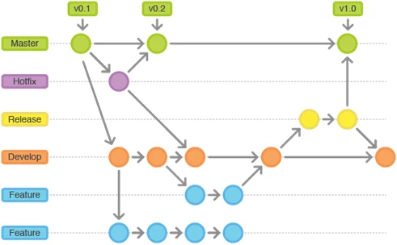

# 安装与配置

  * 三种 Git 服务:

        ①，个人/小团队，直接使用 Git 即可，简单且服务器资源占用少，基于 Git 服务器端命令行管理

        ②，团队规模大/服务器要求较高，搭建 GitLab 服务，可视化界面统一管理

        ③，使用 Github/Gitee 等第三方提供的线上仓库，收费/免费功能受限/安全性

  * 可视化客户端：

        建议使用 GitHub Desktop，下载地址：https://desktop.github.com/

### Git 分支管理策略

  * 如下图所示

    

        (不是一成不变的，按实际情况调整，团队内部使用统一管理策略)

        master               # 主干分支，最为稳定的，功能比较完整的，随时可发布生产环境的代码

        release              # 发布分支，基于 master 分支克隆，发布到线上的版本

        hotfix/bugfix        # 补丁分支，基于 release 分支克隆 , 主要用于对线上的版本进行BUG修复，合并到 release、master分支

        develop              # 开发分支，永远是功能最新最全的分支，测试通过之后，合并到 master 分支

        feature              # 功能分支，每个开发任务建立各自的 feature 分支，开发完成后合并到 develop 分支

### Git 安装与配置

  * 使用 yum 安装 Git 服务，输入命令：

        yum install -y git

        git --version

        ->

            git version 1.8.3.1

  * 创建 Git 用户组、用户，输入命令：

        groupadd gitgroup

        useradd git && passwd git

        useradd zhangsan && passwd zhangsan

        useradd lisi && passwd lisi

        usermod -G gitgroup git

        usermod -G gitgroup zhangsan

        usermod -G gitgroup lisi

  * 若有需要，禁止用户使用 ssh 登录 Git 服务器，输入命令：

        ll /bin/git-shell

        vi /etc/passwd

        =>

            zhangsan:x:1001:1002::/home/zhangsan:/bin/git-shell
            lisi:x:1002:1003::/home/lisi:/bin/git-shell

  * 客户端免密访问 Git 服务配置( 免密访问账号 git 不能禁止其 ssh 登录 )：

        第一步，Git 客户端生成公钥和秘钥， 输入命令：

            cd ~/.ssh/

            # 输入 git 然后两次回车
            ssh-keygen -t rsa

            cat ./git

            cat ./git.pub

        第二步，Git 客户端配置私钥，输入命令：

            cd ~/.ssh/

            ssh-agent bash

            ssh-add ./git

        第三步，Git 服务器配置公钥，输入命令：

            su - git

            mkdir -p  ~/.ssh/

            # 注意把 xxxx 内容替换为 git.pub 文本内容
            cd ~/.ssh/ && echo 'xxxx' >> authorized_keys

            cd ~ && chmod 700 -R .ssh

            cd ~/.ssh/ && chmod 600 authorized_keys

        第四步，Git 客户端免登陆测试：

            # 客户端不存在 authorized_keys 文件，会提示 Are you sure you want to continue connecting (yes/no)? yes 一次性确认即可
            git clone ssh://git@192.168.140.131/home/repo/test.git

  * 创建 Git 项目仓库，并授权用户组，输入命令：

        mkdir -p /home/repo/test.git

        git init --bare /home/repo/test.git

        chgrp -R gitgroup /home/repo/test.git

        chmod -R g+rwX /home/repo/test.git

### GitLab 安装与配置

  * 安装依赖模块：

        yum install -y curl policycoreutils-python openssh-server postfix wget vim

        systemctl enable sshd && systemctl start sshd

        systemctl enable postfix && systemctl start postfix

  * GitLab 下载和安装：

        wget --no-check-certificate https://mirrors.tuna.tsinghua.edu.cn/gitlab-ce/yum/el7/gitlab-ce-15.2.0-ce.0.el7.x86_64.rpm

        rpm -i gitlab-ce-15.2.0-ce.0.el7.x86_64.rpm

  * 更改 GitLab 配置：

        vim  /etc/gitlab/gitlab.rb

        =>

            external_url 'http://192.168.140.131:8050'

  * 配置 GitLab 并启动服务：

        gitlab-ctl reconfigure

        gitlab-ctl restart

        # 个人电脑关闭开机启动
        # systemctl disable gitlab-runsvdir.service

        # 停止服务
        # gitlab-ctl stop

  * 进入管理后台页面，访问以下地址：

        # 服务器端获取管理员 root 初始密码
        cat /etc/gitlab/initial_root_password

        http://192.168.140.131:8050/

  * 关闭用户注册功能：

        点击左上角【Menu】-【Admin】

        点击左侧导航栏【Setting】

        点击【General】-【Sign-up restrictions】-【Sign-up enabled】去除勾选状态

  * 更改管理员密码：

        点击右上角头像【Edit profile】

        点击左侧导航栏【Password】更改新密码
