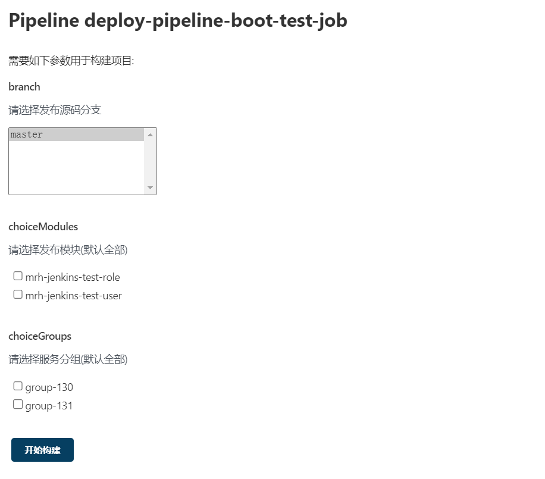

# Jenkins 持续集成 springboot 服务(pipeline)

  * 普通构建局限性：

        ①，普通构建，无法或者难以完成比较复杂的条件判断，例如只能指定单个 label 进行服务器匹配

        ②，服务器比较多的情况下，配置起来不太直观，容易出错

        复杂任务，应引入 jenkins pipeline 构建，基于 Groovy 语言实现的一种 DSL (领域特定语言)，用于描述整条流水线是如何进行的

  * 达成构建目标，如下图所示：

        ①，选择源码分支进行构建

        ②，选择部分、全部模块(服务)进行构建发布

        ③，选择部分、全部服务分组进行发布，例如：

            分组 group-130 服务：service-user-192.168.140.130、service-role-192.168.140.130

            分组 group-131 服务：service-user-192.168.140.131、service-role-192.168.140.131

      

  * 官方网站地址：

        https://www.jenkins.io/

        https://mirrors.jenkins-ci.org/war/latest/

        https://plugins.jenkins.io/git-parameter/

        # 在线 groovy 调试
        https://c.runoob.com/compile/6208/

### 准备 git springboot 源码

  * springboot git 源码结构( maven 父子项目)：

        ssh://git@192.168.140.131/home/repo/mrh-jenkins-test.git

            +- mrh-jenkins-test-parent
            +  +- pom.xml
            +
            +- mrh-jenkins-test-user
            +  +- src/main/java
            +  +  +---------------- org.lushen.mrh.test.Application
            +  +  +---------------- org.lushen.mrh.test.WelcomeController
            +  +- src/main/resources
            +  +  +---------------- application.yml
            +  +- pom.xml
            +  +- startup.sh
            +
            +- mrh-jenkins-test-role
            +  +- src/main/java
            +  +  +---------------- org.lushen.mrh.test.Application
            +  +  +---------------- org.lushen.mrh.test.WelcomeController
            +  +- src/main/resources
            +  +  +---------------- application.yml
            +  +- pom.xml
            +  +- startup.sh

  * 详细信息，查看示例源码地址：

        https://github.com/zfhlm/mrh-example/tree/main/mrh-jenkins/mrh-jenkins-test

### jenkins pipeline 语法简述

  * 常见的 pipeline 编写示例，在 //TODO 区域需要自定义构建逻辑：

        pipeline {
            // 节点代理
            agent any
            // 参数插件
            parameters {
                // TODO
            }
            // 构建步骤
            stages {
                // 清理目录
                stage("clean") {
                    steps {
                        // TODO
                    }
                }
                // 拉取源码
                stage("checkout") {
                    steps {
                        // TODO
                    }
                }
                // 构建源码
                stage("build") {
                    steps {
                        // TODO
                    }
                }
                // 远程发布
                stage("deploy") {
                    steps {
                        // TODO
                    }
                }
            }
        }

  * pipeline 使用 groovy 语言进行描述，那么在 pipeline 之前、之中可以编写 groovy 脚本：

        // TODO

        pipeline {
            ...
            stages {
                // 清理目录
                stage("clean") {
                    steps {
                        script{
                            // TODO
                        }
                    }
                }
            }
        }

        如上所示，在 //TODO 区域可以执行 groovy 脚本，在 pipeline steps 中必须使用 script{} 包含 groovy 脚本

  * pipeline 有 jenkins 自己专属的执行方法，在管理后台通过以下方式访问，可以生成各种示例代码：

        第一步，创建一个流水线构建任务

        第二步，进入流水线构建任务界面，点击左边导航栏[流水线语法]

        第三步，点击[片段生成器] 或 [Declarative Directive Generator]

        第四步，选择需要的配置类型，填写相关信息，生成示例

        (注意，有时生成不一定正确，访问插件文档页面，获取比较详细的文档)

### 初始化 jenkins 服务器

  * 安装 jdk 运行环境：

        (过程略，jdk 路径 /usr/local/jdk )

  * 安装 maven 编译环境：

        (过程略，maven 路径 /usr/local/maven )

  * 安装 git 客户端：

        (过程略，git shell 路径 /bin/git，注意，必须配置 jenkins 服务器 ssh 免密访问 git 服务器)

  * 安装以下 jenkins 插件：

        ①，Maven Integration

        ②，Publish Over SSH

        ③，SSH

        ④，SSH Agent

        ⑤，Build with Parameters

        ⑥，Git parameter

  * 添加/更改 jenkins 全局配置：

        第一步，点击【Manage Jenkins】

        第二步，点击【Global Tool Configuration】

        第三步，填写相关配置：

            Maven 配置

                【默认 settings 提供】一栏选择【文件系统中的setting文件】

                【文件路径】输入：/usr/local/maven/conf/settings.xml

                【默认全局 settings 提供】一栏选择【文件系统中的setting文件】

                【文件路径】输入：/usr/local/maven/conf/settings.xml

            JDK

                【JDK 安装】点击【新增JDK】

                【别名】输入：jdk11

                【JAVA_HOME】输入：/usr/local/jdk

                【自动安装】去除选中状态

            Git

                【Path to Git executable】一栏输入：/usr/bin/git

                【自动安装】去除选中状态

            Maven

                【新增Maven】

                【Name】输入：maven-3.8.3

                【MAVEN_HOME】输入：/usr/local/maven

                【自动安装】去除选中状态

        第四步，点击【保存】，至此完成全局工具配置

  * 添加 jenkins 远程发布服务器：

        第一步，点击【Manage Jenkins】

        第二步，点击【Configure System】

        第三步，下拉找到【Publish over SSH】一栏，填写服务器信息：

            【Passphrase】：服务器登录密码，例如 123456

            【Path to key】：不填

            【Key】：不填

            【SSH Servers】：服务器批量地址

                (注意，服务器 Name 是 pipeline publish 插件 configName 需要的值，相当于 ID，最好使用服务器 IP 地址)

                【Name】：服务器名称，例如 192.168.140.130

                【Hostname】：服务器地址，例如 192.168.140.130

                【Username】：登录账号，例如 root

                【Remote Directory】：远程工作目录，例如 /

            点击【Test Configuration】测试服务器连接是否成功

        第四步，需要配置多个服务器，点击【新增】，重复第三步操作

        第五步，点击【保存】，然后回到主界面

### 创建 pipeline 构建任务

  * 创建任务：

        第一步，点击【新建任务】

        第二步，填写任务名称，例如 deploy-pipeline-boot-test-job

        第三步，选择任务类型，这里选择 [流水线]

        第四步，点击确定，至此完成初步创建

        第五步，按需选择配置 General，例如丢弃旧的构建配置

        进行下一步，主要的配置都在 pipeline 脚本

  * 编写 pipeline 脚本，[流水线] 选择 [Pipeline script]，以下为示例脚本：

        // 全局配置
        def configuration = [
            resources: [
                git: "ssh://git@192.168.140.131/home/repo/mrh-jenkins-test.git",
                repo: "mrh-jenkins-test.git",
                pom: "mrh-jenkins-test-parent/pom.xml",
                modules: [
                    "mrh-jenkins-test-role",
                    "mrh-jenkins-test-user"
                ]
            ],
            groups: ["group-130", "group-131"],
            services: [
                [
                    module: "mrh-jenkins-test-role",
                    jarSourceFiles: "mrh-jenkins-test-role/target/*.jar",
                    jarRemovePrefix: "mrh-jenkins-test-role/target",
                    jarRemoteDirectory: "/usr/local/app/role",
                    jarExecCommand: "",
                    shellSourceFiles: "mrh-jenkins-test-role/startup.sh",
                    shellRemovePrefix: "mrh-jenkins-test-role",
                    shellRemoteDirectory: "/usr/local/app/role",
                    shellExecCommand: "cd /usr/local/app/role && chmod 777 ./startup.sh && sh ./startup.sh",
                    servers: [
                        [address: "192.168.140.130", group: "group-130"],
                        [address: "192.168.140.131", group: "group-131"]
                    ]
                ],[
                    module: "mrh-jenkins-test-user",
                    jarSourceFiles: "mrh-jenkins-test-user/target/*.jar",
                    jarRemovePrefix: "mrh-jenkins-test-user/target",
                    jarRemoteDirectory: "/usr/local/app/user",
                    jarExecCommand: "",
                    shellSourceFiles: "mrh-jenkins-test-user/startup.sh",
                    shellRemovePrefix: "mrh-jenkins-test-user",
                    shellRemoteDirectory: "/usr/local/app/user",
                    shellExecCommand: "cd /usr/local/app/user && chmod 777 ./startup.sh && sh ./startup.sh",
                    servers: [
                        [address: "192.168.140.130", group: "group-130"],
                        [address: "192.168.140.131", group: "group-131"]
                    ]
                ]
            ]
        ]
        // 全局配置生成常量
        def gitParamUseRepository = "*" + configuration.resources.repo
        def moduleParamValue = configuration.resources.modules.toList().join(",")
        def groupParamValue = configuration.groups.toList().join(",")

        // 选择参数解析方法
        def resolveChoiceParam(str) {
            if( str == null || str == "null" || str == "" ) {
                return new HashSet()
            } else {
                return str.split(",").toList().toSet()
            }
        }

        pipeline {

            // 任意节点代理
            agent any

            // 参数选择插件配置
            parameters {
                gitParameter useRepository: gitParamUseRepository, name: "branch", description: "请选择发布源码分支", branchFilter: "origin/(.*)", defaultValue: "", type: "PT_BRANCH"
                extendedChoice value: moduleParamValue, name: "choiceModules", description: "请选择发布模块(默认全部)", multiSelectDelimiter: ",", visibleItemCount: 5, type: "PT_CHECKBOX", quoteValue: false, saveJSONParameterToFile: false
                extendedChoice value: groupParamValue, name: "choiceGroups", description: "请选择服务分组(默认全部)", multiSelectDelimiter: ",", visibleItemCount: 5, type: "PT_CHECKBOX", quoteValue: false, saveJSONParameterToFile: false
            }

            // 构建配置
            stages {
                // 清空工作目录
                stage("clean") {
                    steps {
                        deleteDir()
                    }
                }
                // git 拉取源码
                stage("checkout") {
                    steps {
                        git (
                            url: configuration.resources.git,
                            branch: "${params.branch}"
                        )
                    }
                }
                // maven 构建源码
                stage("build") {
                    steps {
                        script{
                            sh "mvn clean package -Dmaven.test.skip=true -f $configuration.resources.pom"
                        }
                    }
                }
                // ssh 远程发布可执行 jar，并执行启动脚本
                stage("deploy") {
                    steps {
                        script{

                            // 选择参数转换
                            def choiceModules = resolveChoiceParam("$params.choiceModules")
                            def choiceGroups = resolveChoiceParam("$params.choiceGroups")
                            println "Choice modules :: $choiceModules"
                            println "Choice groups :: $choiceGroups"

                            // 部署节点筛选
                            def choiceServers = []
                            for(serviceConfig in configuration.services) {
                                if( ! choiceModules.isEmpty() && ! choiceModules.contains(serviceConfig.module) ) {
                                    println "Not matched :: module=$serviceConfig.module"
                                    continue
                                }
                                println "Matched :: module=$serviceConfig.module"
                                for(serverConfig in serviceConfig.servers) {
                                    if( ! choiceGroups.isEmpty() && ! choiceGroups.contains(serverConfig.group) ) {
                                        println "Not matched :: module=$serviceConfig.module, group=$serverConfig.group, address=$serverConfig.address"
                                        continue
                                    }
                                    println "Matched :: module=$serviceConfig.module, group=$serverConfig.group, address=$serverConfig.address"
                                    choiceServers.add([
                                        serverAddress: serverConfig.address,
                                        serverGroup: serverConfig.group,
                                        module: serviceConfig.module,
                                        jarSourceFiles: serviceConfig.jarSourceFiles,
                                        jarRemovePrefix: serviceConfig.jarRemovePrefix,
                                        jarRemoteDirectory: serviceConfig.jarRemoteDirectory,
                                        jarExecCommand: serviceConfig.jarExecCommand,
                                        shellSourceFiles: serviceConfig.shellSourceFiles,
                                        shellRemovePrefix: serviceConfig.shellRemovePrefix,
                                        shellRemoteDirectory: serviceConfig.shellRemoteDirectory,
                                        shellExecCommand: serviceConfig.shellExecCommand
                                    ])
                                }
                            }
                            println choiceServers

                            // 如果是微服务，可以调用 /actuator/serviceregistry 从注册中心下线节点，再往下执行发布动作
                            // ...

                            // 部署节点发布
                            for(choiceServer in choiceServers) {
                                println "Publish :: module=$choiceServer.module, group=$choiceServer.serverGroup, address=$choiceServer.serverAddress"
                                sshPublisher(publishers: [
                                    sshPublisherDesc(
                                        configName: choiceServer.serverAddress,
                                        transfers: [
                                            sshTransfer(
                                                sourceFiles: choiceServer.jarSourceFiles,
                                                removePrefix: choiceServer.jarRemovePrefix,
                                                remoteDirectory: choiceServer.jarRemoteDirectory,
                                                execCommand: choiceServer.jarExecCommand,
                                                cleanRemote: false,
                                                excludes: "",
                                                execTimeout: 120000,
                                                flatten: false,
                                                makeEmptyDirs: false,
                                                noDefaultExcludes: false,
                                                patternSeparator: "[, ]+",
                                                remoteDirectorySDF: false
                                            ),
                                            sshTransfer(
                                                sourceFiles: choiceServer.shellSourceFiles,
                                                removePrefix: choiceServer.shellRemovePrefix,
                                                remoteDirectory: choiceServer.shellRemoteDirectory,
                                                execCommand: choiceServer.shellExecCommand,
                                                cleanRemote: false,
                                                excludes: "",
                                                execTimeout: 120000,
                                                flatten: false,
                                                makeEmptyDirs: false,
                                                noDefaultExcludes: false,
                                                patternSeparator: "[, ]+",
                                                remoteDirectorySDF: false
                                            )
                                        ],
                                        usePromotionTimestamp: false,
                                        useWorkspaceInPromotion: false,
                                        verbose: false
                                    )
                                ])
                            }

                        }
                    }
                }
            }

        }

### 执行构建任务

  * 第一次构建参数未生效，不能选择参数，直接点击 [立即构建]，第二次构建即可选择参数

  * 开始构建：

        第一步，进入 deploy-pipeline-boot-test-job 任务界面

        第二步，点击 Build with Parameters

        第三步，选择需要发布的分支、模块、分组，然后点击开始构建

        第四步，点击 #xx 进入构建界面，查看构建情况

        第五步，点击 控制台输出，查看实时构建日志

        第六步，等待构建完成，如果出错，排查错误原因 (第一次构建，由于 maven 初始化，时间会比较长)

  * 访问发布的应用：

        http://192.168.140.130:8888/

        http://192.168.140.130:8889/

        http://192.168.140.131:8888/

        http://192.168.140.131:8889/
