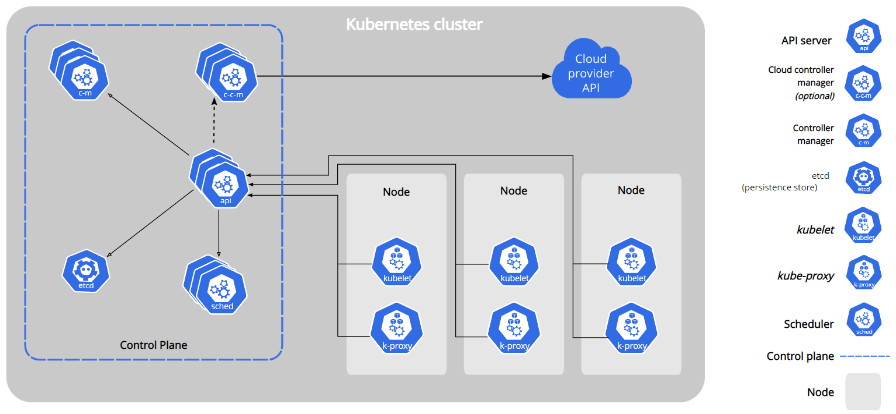
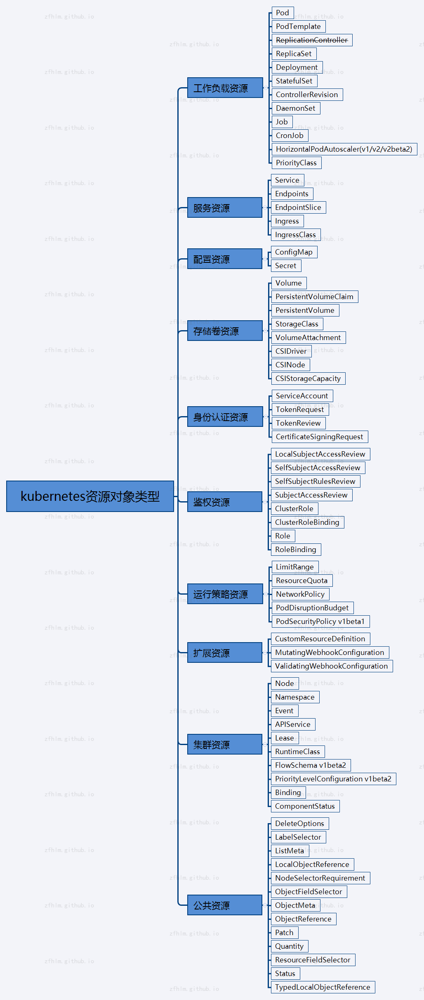
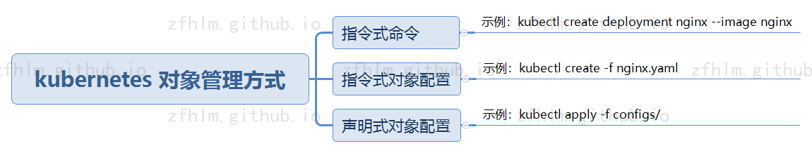

# Kubernetes 相关概念

  * 官方文档地址：

        https://kubernetes.io/

        https://kubernetes.io/docs/home/

### 集群组件

  * 集群组件交互图：

      

      文档地址：https://kubernetes.io/docs/concepts/overview/components/

  * 集群管理节点组件：

        etcd                                    # 强一致性、高可用的键值存储中间件，负责存储整个集群状态数据

        kube-apiserver                          # 集群 HTTP API 服务，负责接收集群管理请求，可水平扩展多个进行负载均衡

        kube-controller-manager                 # 集群状态监控管理，如故障检测、自动扩展、滚动更新等

        kube-scheduler                          # 集群任务调度，根据策略将 Pod 调度到对应的工作节点

        cloud-controller-manager                # 集群连接到云提供商的 API 服务(一般不需要此组件，除非接入云提供商)

  * 集群工作节点组件：

        kubelet                                 # 集群工作节点代理，保证容器都运行在 Pod 中

        kube-proxy                              # 集群中每个工作节点所上运行的网络代理

        Container Runtime                       # 集群容器服务，提供容器运行环境

  * 集群可选插件：

        DNS                                     # 集群 DNS 服务

        Web UI (Dashboard)                      # 可视化 web 管理后台

        Container Resource Monitoring           # 容器资源监控

        Cluster-level Logging                   # 集群日志插件

### 集群资源

  * 集群资源对象类型：

      

      文档地址：https://kubernetes.io/docs/reference/kubernetes-api/

  * 集群资源对象管理：

      

      文档地址：https://kubernetes.io/docs/concepts/overview/working-with-objects/object-management/
