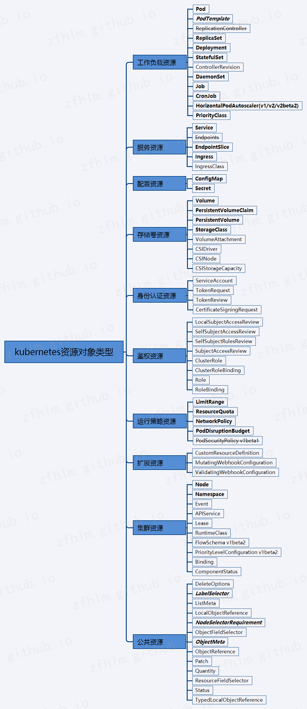

# Kubernetes 相关概念

  * 官方文档地址：

        https://kubernetes.io/

        https://kubernetes.io/docs/home/

### 集群组件

  * 集群组件交互图：

      

  * 文档地址：

        https://kubernetes.io/docs/concepts/overview/components/

  * 集群管理节点组件：

        etcd                                    # 集群状态数据存储     //  强一致性、高可用的键值存储中间件

        kube-apiserver                          # 集群管理 API 服务    //  可水平扩展多个进行负载均衡

        kube-controller-manager                 # 集群状态监控管理     //  如故障检测、自动扩展、滚动更新等

        kube-scheduler                          # 集群任务调度         //  根据策略将 Pod 调度到对应的工作节点

        cloud-controller-manager                # 云服务厂商 API 服务  //  一般不需要此组件

  * 集群工作节点组件：

        kubelet                                 # 集群工作节点代理     //  保证容器都运行在 Pod 中

        kube-proxy                              # 集群工作网络代理     //  每个工作节点上都会运行一个网络代理

        Container Runtime                       # 集群容器运行环境     //  例如 docker、containerd

  * 集群可选插件：

        DNS                                     # 集群 DNS 服务        //  例如 Service 的 DNS 解析

        Web UI (Dashboard)                      # 可视化管理后台       //  浏览器 web 页面后台，方便进行集群资源发布

        Container Resource Monitoring           # 容器资源监控         //  将容器度量指标记录在时序数据库中,并提供 UI 界面

        Cluster-level Logging                   # 集群日志插件         //  保存、搜索、查看容器日志

### 集群资源

  * 集群资源：

      

  * 文档地址：

        https://kubernetes.io/docs/concepts/

        https://kubernetes.io/docs/reference/kubernetes-api/

  * 比较常用的资源：

        // 工作负载资源：

            Pod                                     # 容器基本运行单元     //  一个 Pod 包含一组容器，Pod 内的容器共享相同的ip和端口空间

            PodTemplate                             # Pod 模板             //  用于创建多个预定义的 Pod 副本

            ReplicaSet                              # Pod 副本集           //  用于保证一定数量的 Pod 能够在集群中正常运行

            Deployment                              # Pod 发布副本集       //  用于管理 ReplicaSet，并提供运行策略、更新策略、版本回滚等功能

            StatefulSet                             # Pod 有状态副本集     //  用来管理某 Pod 集合的部署和扩缩，并为这些 Pod 提供持久存储和持久标识符

            DaemonSet                               # 守护程序集           //  确保指定的节点上都运行一个 Pod 的副本

            Job                                     # 普通任务             //  单个作业的配置

            CronJob                                 # 定时任务             //  单个定时作业的配置

            HorizontalPodAutoscaler(v1/v2/v2beta2)  # Pod 水平自动扩缩器   //  根据指标自动管理实现 scale 子资源的任何资源的副本数

        // 服务资源：

            Service                                 # 抽象服务             //  定义一组 Pod 的逻辑集合，以及用于访问它们的策略

            Endpoints                               # 网络端点集           //  用于暴露集群内部、外部的访问端点

            EndpointSlice                           # 网络端口切片         //  相比 Endpoints 进行了优化，最新版本默认替代了 Endpoints

            Ingress                                 # 集群网络入口         //  服务端点暴露、路由转发

        // 配置资源：

            ConfigMap                               # 配置类型数据         //  声明通用的配置变量

            Secret                                  # 保密类型数据         //  声明某些类别的秘密数据，例如账号密码

        // 存储资源：

            Volume                                  # 存储卷               //  表示 Pod 中一个有名字的卷，可以由 Pod 中的任意容器进行访问

            PersistentVolumeClaim                   # 持久卷声明           //  用户针对一个持久卷的请求和申领

            PersistentVolume                        # 持久卷               //  管理员制备的一个持久存储资源

            StorageClass                            # 持久卷存储类型       //  对存储卷进行描述分类

        // 运行策略资源：

            LimitRange                              # 资源用量限制         //  可用于限制内存和 CPU 使用量

            ResourceQuota                           # 资源配额             //  限制命名空间的资源消耗总量

            NetworkPolicy                           # 网络策略             //  可用于控制 Pod 出入流量

            PodDisruptionBudget                     # 中断预算             //  可用于配置 Pod 最低个数或百分比数

        // 集群资源：

            Node                                    # 工作节点             //  可以是一台物理机、虚拟机

            Namespace                               # 命名空间             //  用于隔离不同环境的资源

  * 集群资源管理三种方式：

      

        指令式命令                              # 使用命令行声明所有参数

        指令式对象配置                          # 使用 yaml 配置文件声明

        声明式对象配置                          # 使用目录下的多个 yaml 配置文件声明

### 集群命令

  * 文档地址：

        https://kubernetes.io/docs/reference/generated/kubectl/kubectl-commands

        (官方文档包含详细的字段、使用示例)
