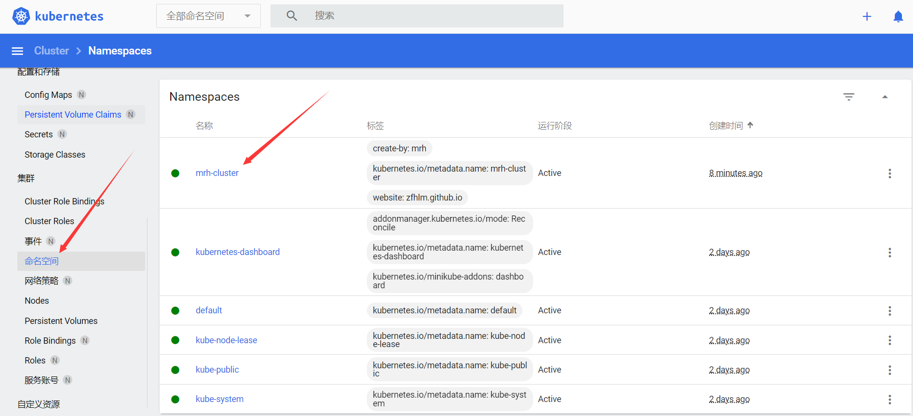
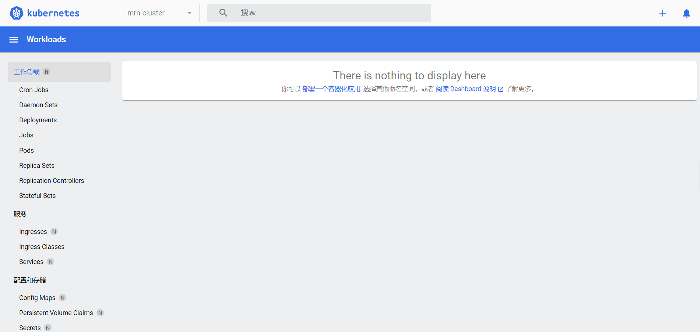

# Kubernetes 集群资源

  * 官方文档地址：

        https://kubernetes.io/docs/concepts/overview/working-with-objects/namespaces/

        https://kubernetes.io/docs/tasks/administer-cluster/namespaces/

        https://kubernetes.io/docs/reference/kubernetes-api/cluster-resources/namespace-v1/

        https://kubernetes.io/docs/reference/generated/kubernetes-api/v1.24/#namespace-v1-core

### Namespace

  * 编写 Namespace 对象配置：

        apiVersion: v1
        kind: Namespace
        metadata:
          name: mrh-cluster
          labels:
            created-by: mrh
            website: zfhlm.github.io

  * 使用 Minikube dashboard 创建 Namespace：

      

  * 使用 Minikube dashboard 查看 Namespace：

      

  * 由于 Namespace 作为最顶级资源，还未创建所属工作负载资源对象：

      
