# Kubernetes 工作负载资源

  * 官方文档：

        https://kubernetes.io/docs/home/

        https://kubernetes.io/docs/reference/kubernetes-api/workload-resources/

        https://kubernetes.io/docs/concepts/workloads/

  * 常用资源：

        Pod                                     # 容器基本运行单元

        PodTemplate                             # 模板(不直接创建，由其他资源对象声明与使用)

        ReplicaSet                              # 副本集

        Deployment                              # 发布副本集

        StatefulSet                             # 有状态副本集

        DaemonSet                               # 守护程序集

        Job                                     # 普通任务

        CronJob                                 # 定时任务

        HorizontalPodAutoscaler                 # 水平自动扩缩器

        PriorityClass                           # 优先级类型

## Pod

  * 简单介绍：

        Pod 是容器最基本的运行单元， 一个 Pod 包含一组容器，Pod 内的容器共享相同的 IP 和 port 空间

  * 文档地址：

        https://kubernetes.io/docs/concepts/workloads/pods/

        https://kubernetes.io/docs/tasks/configure-pod-container/

        https://kubernetes.io/docs/reference/kubernetes-api/workload-resources/pod-v1/

        https://kubernetes.io/docs/reference/generated/kubernetes-api/v1.24/#pod-v1-core

  * Pod 运行状态：

        Pending                     # Pod 已被 Kubernetes 系统接受，但有一个或者多个容器尚未创建亦未运行。

        Running                     # Pod 已经绑定到了某个节点，Pod 中所有的容器都已被创建。至少有一个容器仍在运行，或者正处于启动或重启状态。

        Succeeded                   # Pod 中的所有容器都已成功终止，并且不会再重启。

        Failed                      # Pod 中的所有容器都已终止，并且至少有一个容器是因为失败终止。也就是说，容器以非 0 状态退出或者被系统终止。

        Unknown                     # 因为某些原因无法取得 Pod 的状态。这种情况通常是因为与 Pod 所在主机通信失败。

  * Pod 初始化容器、运行探针、生命周期钩子：

        initContainer               # 指定初始化工作的容器，一个或者多个按顺序执行

        startupProbe                # 启动探针

        readinessProbe              # 就绪探针

        livenessProbe               # 存活探针

        lifecycle.postStart         # 启动后执行

        lifecycle.preStop           # 停止前执行

  * Pod 对象配置，基于 centos7 示例：

        apiVersion: v1
        kind: Pod
        metadata:
          name: centos
          namespace: mrh-cluster
          labels:
            cluster: mrh-cluster
            service: centos
            created-by: mrh
            website: zfhlm.github.io
        spec:
          restartPolicy: Always
          containers:
          - name: centos
            image: centos:centos7
            imagePullPolicy: IfNotPresent
            command: ['/bin/sh', '-c', '/usr/sbin/init']

  * Pod 对象配置，基于 nginx 示例：

        apiVersion: v1
        kind: Pod
        metadata:
          # 名称
          name: nginx
          # 命名空间
          namespace: mrh-cluster
          # 标签
          labels:
            cluster: mrh-cluster
            service: nginx
            version: v1.23.1
            created-by: mrh
            website: zfhlm.github.io
        spec:
          # 重启策略
          restartPolicy: Always
          # 选择存在以下 Label 的节点
          # nodeSelector:
          #   node-role.kubernetes.io/master
          # 容器配置
          containers:
          - name: nginx
            image: nginx
            imagePullPolicy: Always
            # 端口配置
            ports:
            - name: http
              protocol: TCP
              containerPort: 80
            # 资源限制
            resources:
              requests:
                cpu: 0.5
                memory: 32M
              limits:
                cpu: 0.5
                memory: 128M
            # 容器挂载，注意 name 对应 spec.volumes[n].name
            volumeMounts:
            - name: log
              mountPath: /var/log/nginx/
            # 就绪探针
            readinessProbe:
              initialDelaySeconds: 10
              periodSeconds: 5
              timeoutSeconds: 1
              tcpSocket:
                port: 80
            # 存活探针
            livenessProbe:
              initialDelaySeconds: 60
              timeoutSeconds: 2
              periodSeconds: 15
              tcpSocket:
                port: 80
            # 生命周期Hooks
            lifecycle:
              # 测试，启动后替换 index.html 内容
              postStart:
                exec:
                  command: ['/bin/sh', '-c', 'echo postStart > /usr/share/nginx/html/index.html']
              # 测试，停止前替换 index.html 内容
              preStop:
                exec:
                  command: ['/bin/sh', '-c', 'echo preStop > /usr/share/nginx/html/index.html']
          # 挂载配置
          volumes:
          - name: log
            # 宿主机目录
            hostPath:
              path: /var/log/nginx/

  * Pod 对象配置，基于 spring cloud 示例：

        apiVersion: v1
        kind: Pod
        metadata:
          name: mrh-spring-cloud-service-user
          namespace: mrh-cluster
          labels:
            cluster: mrh-cluster
            service: mrh-spring-cloud-service-user
            version: v1.0
            created-by: mrh
            website: zfhlm.github.io
        spec:
          restartPolicy: Always
          containers:
          - name: mrh-spring-cloud-service-user
            image: mrh-spring-cloud-service-user:1.0
            imagePullPolicy: Always
            env:
            - name: SPRING_PROFILES_ACTIVE
              value: dev
            ports:
            - name: http
              protocol: TCP
              containerPort: 8888
            resources:
              requests:
                cpu: 1.0
                memory: 256M
              limits:
                cpu: 2.0
                memory: 2048M
            volumeMounts:
            - name: log
              mountPath: /usr/local/logs/
            # actuator 健康检测
            readinessProbe:
              initialDelaySeconds: 10
              periodSeconds: 5
              timeoutSeconds: 1
              httpGet:
                scheme: HTTP
                port: 8888
                path: /actuator/health
            # actuator 健康检测
            livenessProbe:
              initialDelaySeconds: 60
              timeoutSeconds: 2
              periodSeconds: 15
              httpGet:
                scheme: HTTP
                port: 8888
                path: /actuator/health
            # 停止前从注册中心移除当前实例
            lifecycle:
              preStop:
                exec:
                  command: ['/bin/sh', '-c', 'curl -X POST /actuator/serviceregistry -d {"status":"DOWN"} -H "Content-Type:application/json"']
          volumes:
          - name: log
            hostPath:
              path: /usr/local/logs/

  * 控制台界面，查看已创建的 Pod 资源对象：

      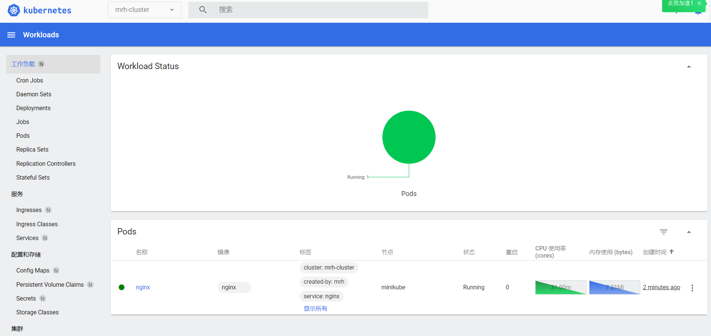

## ReplicaSet

  * 简单介绍：

        ReplicaSet 使用 PodTemplate 创建 Pod 副本集，用于保证一定数量的 Pod 能够在集群中正常运行

        ReplicaSet 先被创建，再由 ReplicaSet 创建并管理 Pod

        ReplicaSet 被删除，则相应的 Pod 也会被删除

  * 文档地址：

        https://kubernetes.io/docs/concepts/workloads/controllers/replicaset/

        https://kubernetes.io/docs/reference/kubernetes-api/workload-resources/replica-set-v1/

        https://kubernetes.io/docs/reference/generated/kubernetes-api/v1.24/#replicaset-v1-apps

  * ReplicaSet 对象配置，基于 nginx 示例：

        apiVersion: apps/v1
        kind: ReplicaSet
        metadata:
          name: nginx
          namespace: mrh-cluster
          # ReplicaSet 标签
          labels:
            cluster: mrh-cluster
            created-by: mrh
            website: zfhlm.github.io
        spec:
          # Pod 副本数
          replicas: 3
          # Pod 匹配标签
          selector:
            matchLabels:
              cluster: mrh-cluster
              service: nginx
              version: v1.0
          # Pod 模板配置
          template:
            # Pod 标签
            metadata:
              labels:
                cluster: mrh-cluster
                service: nginx
                version: v1.0
            spec:
              restartPolicy: Always
              containers:
              - name: nginx
                image: nginx
                imagePullPolicy: Always
                ports:
                - name: http
                  protocol: TCP
                  containerPort: 80
                resources:
                  requests:
                    cpu: 0.1
                    memory: 32M
                  limits:
                    cpu: 0.2
                    memory: 128M
                volumeMounts:
                - name: log
                  mountPath: /var/log/nginx/
                readinessProbe:
                  initialDelaySeconds: 10
                  periodSeconds: 5
                  timeoutSeconds: 1
                  tcpSocket:
                    port: 80
                livenessProbe:
                  initialDelaySeconds: 60
                  timeoutSeconds: 2
                  periodSeconds: 15
                  tcpSocket:
                    port: 80
                lifecycle:
                  postStart:
                    exec:
                      command: ['/bin/sh', '-c', 'echo postStart > /usr/share/nginx/html/index.html']
                  preStop:
                    exec:
                      command: ['/bin/sh', '-c', 'echo preStop > /usr/share/nginx/html/index.html']
              volumes:
              - name: log
                hostPath:
                  path: /var/log/nginx/

  * 控制台界面，查看已创建的 ReplicaSet 资源对象（ 1 个 ReplicaSet，3 个 Pod ）：

      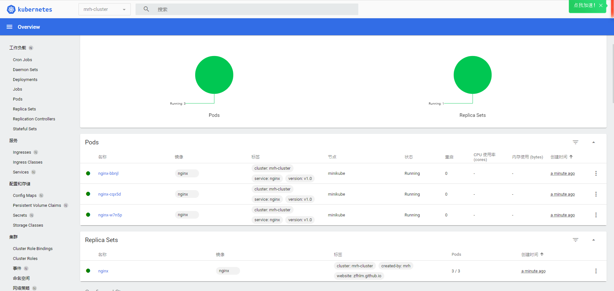

## Deployment

  * 简单介绍：

        Deployment 用于管理 ReplicaSet，并提供运行策略、更新策略、版本回滚等功能

        Deployment 先被创建，然后由 Deployment 创建和管理 ReplicaSet，再由 ReplicaSet 创建并管理 Pod

        Deployment 被删除，则对应的 ReplicaSet、Pod 也会被删除

  * 文档地址：

        https://kubernetes.io/docs/concepts/workloads/controllers/deployment/

        https://kubernetes.io/docs/reference/kubernetes-api/workload-resources/deployment-v1/

        https://kubernetes.io/docs/reference/generated/kubernetes-api/v1.24/#deployment-v1-apps

  * Deployment 对象配置，以 nginx 示例：

        apiVersion: apps/v1
        kind: Deployment
        metadata:
          name: nginx
          namespace: mrh-cluster
          labels:
            cluster: mrh-cluster
            created-by: mrh
            website: zfhlm.github.io
        spec:
          # 副本数
          replicas: 3
          # 更新策略
          strategy:
            type: RollingUpdate
            rollingUpdate:
              # 更新时 Pod 可超出数量
              maxSurge: 0
              # 更新时下线 Pod 数量
              maxUnavailable: 1
          # 保留历史版本数
          revisionHistoryLimit: 5
          # Pod 匹配标签
          selector:
            matchLabels:
              cluster: mrh-cluster
              service: nginx
              version: v1.23.1
          # Pod 模板配置
          template:
            # Pod 标签
            metadata:
              labels:
                cluster: mrh-cluster
                service: nginx
                version: v1.23.1
            spec:
              restartPolicy: Always
              containers:
              - name: nginx
                image: nginx
                imagePullPolicy: Always
                ports:
                - name: http
                  protocol: TCP
                  containerPort: 80
                resources:
                  requests:
                    cpu: 0.1
                    memory: 32M
                  limits:
                    cpu: 0.2
                    memory: 128M
                volumeMounts:
                - name: log
                  mountPath: /var/log/nginx/
                readinessProbe:
                  initialDelaySeconds: 10
                  periodSeconds: 5
                  timeoutSeconds: 1
                  tcpSocket:
                    port: 80
                livenessProbe:
                  initialDelaySeconds: 60
                  timeoutSeconds: 2
                  periodSeconds: 15
                  tcpSocket:
                    port: 80
                lifecycle:
                  postStart:
                    exec:
                      command: ['/bin/sh', '-c', 'echo postStart > /usr/share/nginx/html/index.html']
                  preStop:
                    exec:
                      command: ['/bin/sh', '-c', 'echo preStop > /usr/share/nginx/html/index.html']
              volumes:
              - name: log
                hostPath:
                  path: /var/log/nginx/

  * Deployment 版本回退 (一般不这么操作，保留历史 yaml 文件，使用 kubectl apply -f deployment.yaml 进行回滚)：

        kubectl rollout history deployment nginx --namespace=mrh-cluster

        ->

            deployment.apps/nginx
            REVISION  CHANGE-CAUSE
            2         <none>
            4         <none>
            5         <none>

        kubectl rollout undo deployment nginx --to-revision=4 --namespace=mrh-cluster

  * 控制台界面，查看已创建的 Deployment 资源对象（ 1 个 Deployment，1 个 ReplicaSet，3 个 Pod ）：

      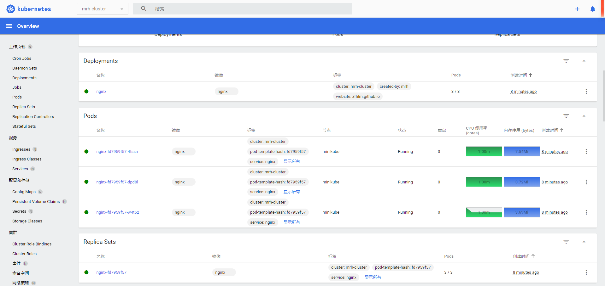

## StatefulSet

  * 简单介绍：

        StatefulSet 用来管理某 Pod 集合的部署和扩缩，并为这些 Pod 提供持久存储和持久标识符

        StatefulSet 被删除，则对应的 Pod 也会被删除，但是 Pod 挂载的永久存储卷不会被删除，且下次创建启动后会自动关联对应的永久存储卷

  * 主要特点：

        稳定的存储：Pod 都有各自的永久存储（使用 PVC 实现）

        稳定的网络：Pod Name 和 HostName 不变，与 Pod 运行的节点无关（使用 Headless Service 实现）

        有序的启动：Pod 启动按顺序执行，状态为 Running | Ready 后才会执行下一个 Pod 启动，并且 Pod 名称后缀 0-N 分配

        有序的收缩：Pod 被删除，从 N 后缀的 Pod 开始，到 0 后缀 Pod

  * 文档地址：

        https://kubernetes.io/docs/concepts/workloads/controllers/statefulset/

        https://kubernetes.io/docs/reference/kubernetes-api/workload-resources/stateful-set-v1/

        https://kubernetes.io/docs/reference/generated/kubernetes-api/v1.23/#statefulset-v1-apps

  * StatefulSet 对象配置，基于 mysql 示例 (此处只关注其顺序)：

        apiVersion: apps/v1
        kind: StatefulSet
        metadata:
          name: mysql
          namespace: mrh-cluster
          labels:
            cluster: mrh-cluster
            created-by: mrh
            website: zfhlm.github.io
        spec:
          replicas: 2
          revisionHistoryLimit: 5
          updateStrategy:
            type: RollingUpdate
            rollingUpdate:
              partition: 0
          selector:
            matchLabels:
              cluster: mrh-cluster
              service: mysql
              version: 5.7.39
          template:
            metadata:
              labels:
                cluster: mrh-cluster
                service: mysql
                version: 5.7.39
            spec:
              restartPolicy: Always
              containers:
              - name: mysql
                image: mysql:5.7.39
                imagePullPolicy: IfNotPresent
                env:
                - name: MYSQL_ROOT_PASSWORD
                  value: '123456'
                ports:
                - name: http
                  protocol: TCP
                  containerPort: 3306
                resources:
                  requests:
                    cpu: 0.2
                    memory: 128M
                  limits:
                    cpu: 0.4
                    memory: 256M
                readinessProbe:
                  initialDelaySeconds: 20
                  periodSeconds: 10
                  timeoutSeconds: 2
                  exec:
                    command: ['/bin/sh', '-c', 'mysqladmin ping -uroot -p123456']
                livenessProbe:
                  initialDelaySeconds: 60
                  timeoutSeconds: 2
                  periodSeconds: 15
                  exec:
                    command: ['/bin/sh', '-c', 'mysqladmin ping -uroot -p123456']

  * 控制台界面，查看已创建的 StatefulSet 资源对象（ 1 个 StatefulSet，2 个 Pod ）：

      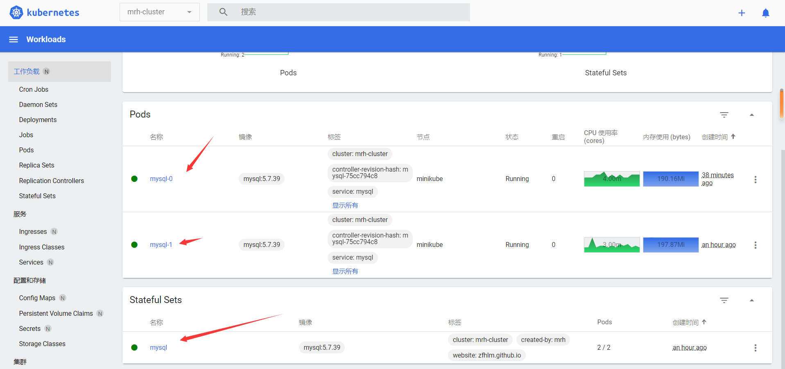

      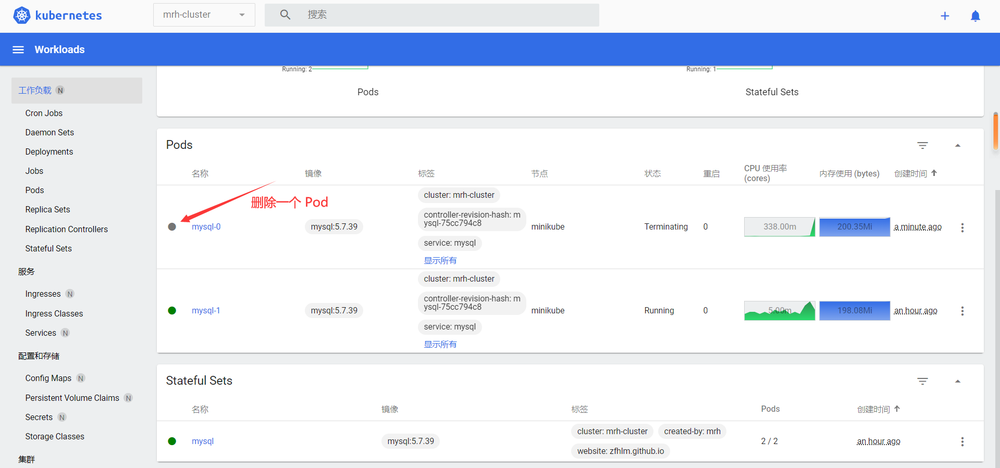

      

## DaemonSet

  * 简单介绍：

        DaemonSet 用于确保指定的节点上都运行一个 Pod 的副本，可用于例如 filebeat 服务器日志采集等

        DaemonSet 创建之后，会创建对应数量的 Pod

        DaemonSet 删除后，对应的 Pod 也会被删除

  * 文档地址：

        https://kubernetes.io/docs/concepts/workloads/controllers/daemonset/

        https://kubernetes.io/docs/reference/kubernetes-api/workload-resources/daemon-set-v1/

        https://kubernetes.io/docs/reference/generated/kubernetes-api/v1.24/#daemonset-v1-apps

  * DaemonSet 对象配置示例：

        apiVersion: apps/v1
        kind: DaemonSet
        metadata:
          name: nginx
          namespace: mrh-cluster
          labels:
            cluster: mrh-cluster
            created-by: mrh
            website: zfhlm.github.io
        spec:
          selector:
            matchLabels:
              cluster: mrh-cluster
              service: nginx
              version: v1.23.1
          template:
            metadata:
              labels:
                cluster: mrh-cluster
                service: nginx
                version: v1.23.1
            spec:
              containers:
              - name: nginx
                image: nginx
                ports:
                - containerPort: 80

  * 控制台界面，查看已创建的 DaemonSet 资源对象（ 1 个 DaemonSet，因为使用的是 minikube 所以只有 1 个 Pod ）：

      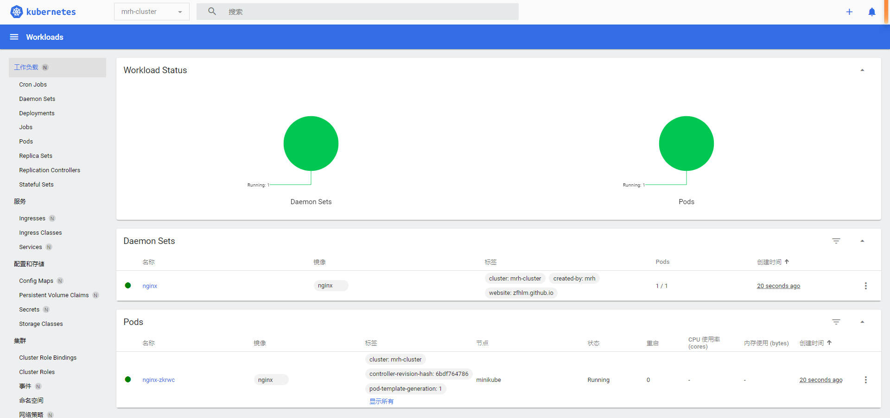

## Job

  * 简单介绍：

        Job 用于执行单次的任务

        Job 创建后，会使用 PodTemplate 创建 Pod

        Job 被删除，对应的 Pod 也会被删除

        Job 运行完成后，对应的 Pod 不会被删除，也不会占用集群资源

  * 文档地址：

        https://kubernetes.io/docs/concepts/workloads/controllers/job/

        https://kubernetes.io/docs/reference/kubernetes-api/workload-resources/job-v1/

        https://kubernetes.io/docs/reference/generated/kubernetes-api/v1.24/#job-v1-batch

  * Job 对象配置示例：

        apiVersion: batch/v1
        kind: Job
        metadata:
          name: echo-hello
          namespace: mrh-cluster
          labels:
            cluster: mrh-cluster
            created-by: mrh
            website: zfhlm.github.io
        spec:
          template:
            metadata:
              labels:
                cluster: mrh-cluster
                service: busybox-echo
                version: latest
            spec:
              containers:
              - name: echo-hello
                image: busybox
                command: ["/bin/sh",  "-c", "echo hello"]
              restartPolicy: Never
          backoffLimit: 4

  * 控制台界面，查看已创建的 Job 资源对象（ 1 个 Job，1 个 Pod ）：

      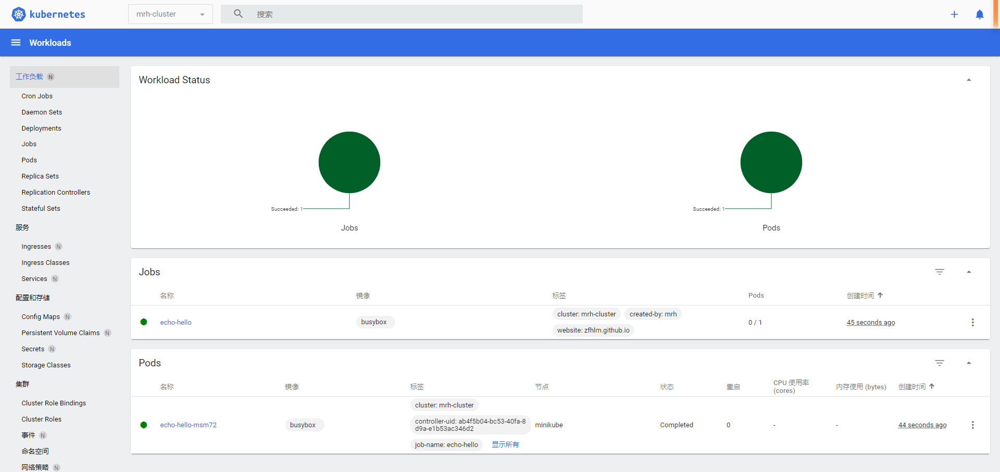

## CronJob

  * 简单介绍：

        CronJob 用于执行定时调度任务

        CronJob 创建后，每次执行都会创建一个 Job，再由 Job 创建 Pod

        CronJob 被删除，对应的 Job、Pod 也会被删除

        CronJob 运行完成后，默认保留 10 个 Job 历史对象，可以调整参数进行控制

  * 文档地址：

        https://kubernetes.io/docs/concepts/workloads/controllers/cron-jobs/

        https://kubernetes.io/docs/tasks/job/automated-tasks-with-cron-jobs/

        https://kubernetes.io/docs/reference/kubernetes-api/workload-resources/cron-job-v1/

        https://kubernetes.io/docs/reference/generated/kubernetes-api/v1.24/#cronjob-v1-batch

  * CronJob 对象配置示例：

        apiVersion: batch/v1
        kind: CronJob
        metadata:
          name: echo-hello
          namespace: mrh-cluster
          labels:
            cluster: mrh-cluster
            created-by: mrh
            website: zfhlm.github.io
        spec:
          schedule: "*/1 * * * *"
          failedJobsHistoryLimit: 10
          successfulJobsHistoryLimit: 10
          jobTemplate:
            spec:
              template:
                metadata:
                  labels:
                    cluster: mrh-cluster
                    service: busybox-echo
                    version: latest
                spec:
                  containers:
                  - name: hello
                    image: busybox
                    imagePullPolicy: IfNotPresent
                    command: ['/bin/sh', '-c', 'echo hello']
                  restartPolicy: OnFailure

  * 控制台界面，查看已创建的 CronJob 资源对象（ 1 个 CronJob，多对 Job 和 Pod ）：

      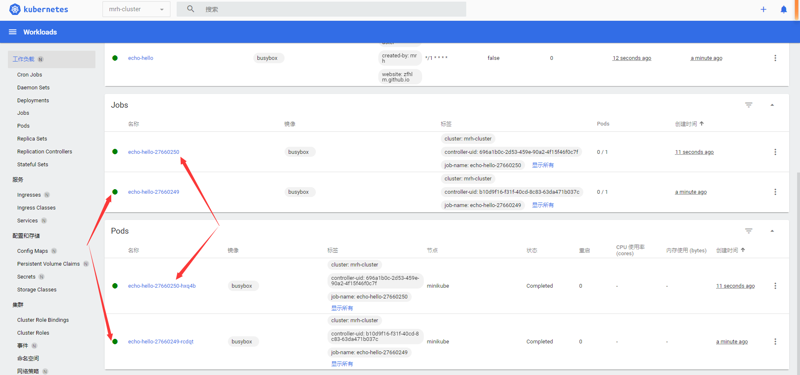

## HorizontalPodAutoscaler

  * 简单介绍：

        HorizontalPodAutoscaler 用于对 Pod 副本的水平自动扩大和缩减，根据 metrics-server 指标自动管理实现 scale 子资源的任何资源的副本数

        注意，metrics-server 通过 kubectl get pod --namespace=kube-system 查询是否存在，不存在则必须下载并运行 Pod

  * 文档地址：

        https://kubernetes.io/docs/reference/kubernetes-api/workload-resources/horizontal-pod-autoscaler-v2beta2/

        https://kubernetes.io/docs/reference/generated/kubernetes-api/v1.23/#horizontalpodautoscaler-v2beta2-autoscaling

        https://github.com/kubernetes-sigs/metrics-server

  * HorizontalPodAutoscaler 对象配置示例：

        apiVersion: apps/v1
        kind: Deployment
        metadata:
          name: nginx
          namespace: mrh-cluster
          labels:
            cluster: mrh-cluster
            created-by: mrh
            website: zfhlm.github.io
        spec:
          replicas: 3
          strategy:
            type: RollingUpdate
            rollingUpdate:
              maxSurge: 0
              maxUnavailable: 1
          revisionHistoryLimit: 5
          selector:
            matchLabels:
              cluster: mrh-cluster
              service: nginx
              version: v1.23.1
          template:
            metadata:
              labels:
                cluster: mrh-cluster
                service: nginx
                version: v1.23.1
            spec:
              restartPolicy: Always
              containers:
              - name: nginx
                image: nginx
                imagePullPolicy: Always
                ports:
                - name: http
                  protocol: TCP
                  containerPort: 80
        --------------------------------------------------------
        apiVersion: autoscaling/v2beta2
        kind: HorizontalPodAutoscaler
        metadata:
          name: nginx
          namespace: mrh-cluster
          labels:
            cluster: mrh-cluster
            created-by: mrh
            website: zfhlm.github.io
        spec:
          # 最小副本数
          minReplicas: 3
          # 最大副本数
          maxReplicas: 6
          # 控制资源
          scaleTargetRef:
            apiVersion: apps/v1
            kind: Deployment
            name: nginx
          # 控制行为
          behavior:
            # 缩容配置
            scaleDown:
              # 统计指标时间窗口(秒)
              stabilizationWindowSeconds: 60
              # 缩容策略
              policies:
                # 每 15 秒缩减一个 Pod
              - type: Pods
                value: 1
                periodSeconds: 15
            # 扩容配置
            scaleUp:
              # 统计指标时间窗口(秒)
              stabilizationWindowSeconds: 15
              # 扩容策略
              policies:
                # 每 15 秒增加一个 Pod
              - type: Pods
                value: 1
                periodSeconds: 15
                # 每 15 秒增加一半 Pod
              - type: Percent
                value: 50
                periodSeconds: 15
          # 计算指标，相关类型查看官方文档
          metrics:
            # CPU 平均利用率达到 80%
          - type: Resource
            resource:
              name: cpu
              target:
                type: Utilization
                averageUtilization: 80
            # 内存平均使用数达到 64M
          - type: Resource
            resource:
              name: memory
              target:
                type: AverageValue
                averageValue: 64Mi

  * 测试时将内存阈值降低到 1 Mi，效果：

      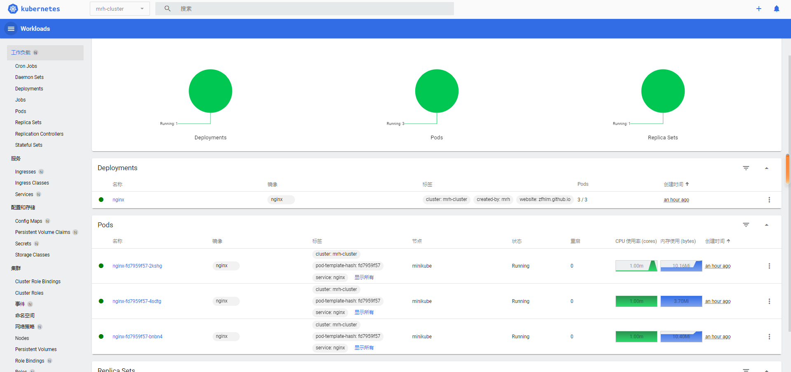

      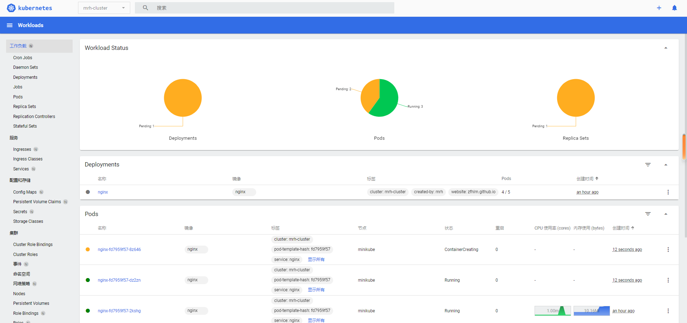

      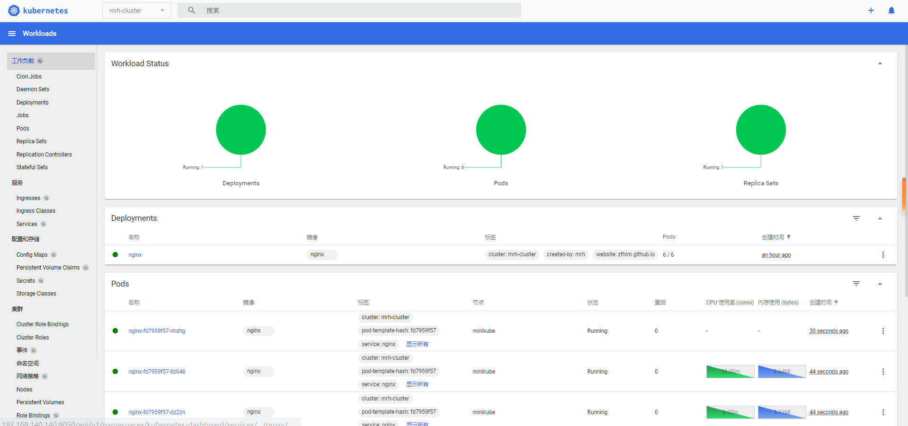

## PriorityClass

  * 简单介绍：

        PriorityClass 定义了优先级类名跟优先级整数值的映射，Pod 通过配置 priorityClassName 关联优先级数值，可以类比 Java 中的枚举

        Pod 调度过程中，调度高优先级 Pod，当 Pod 无法被调度时，会尝试驱逐优先级低的 Pod 再进行高优先级 Pod 调度

  * 文档地址：

        https://kubernetes.io/docs/reference/kubernetes-api/workload-resources/priority-class-v1/

        https://kubernetes.io/docs/reference/generated/kubernetes-api/v1.24/#priorityclass-v1-scheduling-k8s-io

  * PriorityClass 对象配置示例：

        # 三个优先级： critical-high 100  critical-middle 50  critical-low 10

        apiVersion: scheduling.k8s.io/v1
        kind: PriorityClass
        # 名称定义
        metadata:
          name: critical-high
          labels:
            created-by: mrh
            website: zfhlm.github.io
        # 抢占策略
        preemptionPolicy: PreemptLowerPriority
        # 作为默认优先级
        globalDefault: false
        # 优先级数值
        value: 100
        ------------------------------------------
        apiVersion: scheduling.k8s.io/v1
        kind: PriorityClass
        metadata:
          name: critical-middle
          labels:
            created-by: mrh
            website: zfhlm.github.io
        preemptionPolicy: PreemptLowerPriority
        globalDefault: false
        value: 50
        ------------------------------------------
        apiVersion: scheduling.k8s.io/v1
        kind: PriorityClass
        metadata:
          name: critical-low
          labels:
            created-by: mrh
            website: zfhlm.github.io
        preemptionPolicy: PreemptLowerPriority
        globalDefault: false
        value: 10

  * PriorityClass 控制台不支持查询该类型，使用命令：

        kubectl get PriorityClass

        ->

            NAME                      VALUE        GLOBAL-DEFAULT   AGE
            critical-high             100          false            3m22s
            critical-low              10           false            2m58s
            critical-middle           50           false            3m10s
            system-cluster-critical   2000000000   false            17h
            system-node-critical      2000001000   false            17h

  * Pod 使用 PriorityClass 配置示例：

        apiVersion: v1
        kind: Pod
        metadata:
          name: centos
          namespace: mrh-cluster
          labels:
            cluster: mrh-cluster
            service: centos
            created-by: mrh
            website: zfhlm.github.io
        spec:
          restartPolicy: Always
          # 指定优先级名称
          priorityClassName: critical-middle
          containers:
          - name: centos
            image: centos:centos7
            imagePullPolicy: IfNotPresent
            command: ['/bin/sh', '-c', '/usr/sbin/init']
            resources:
              requests:
                cpu: 0.1
                memory: 16M
              limits:
                cpu: 0.5
                memory: 32M

  * Pod 查看 Priority 优先级，输入命令：

        kubectl describe pod centos --namespace=mrh-cluster | grep Priority

        ->

            Priority:             50
            Priority Class Name:  critical-middle
