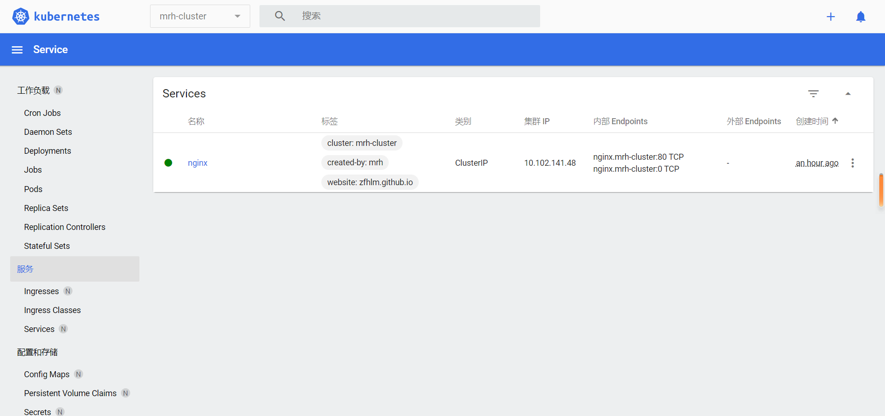
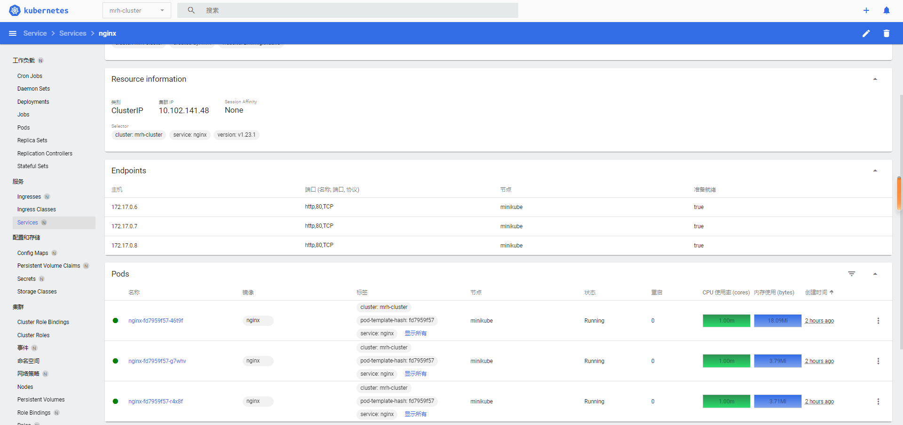
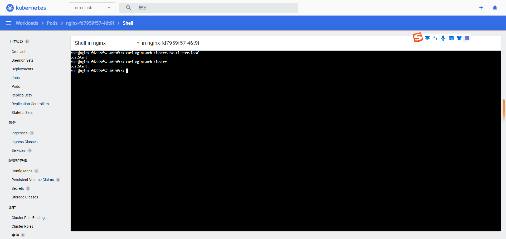
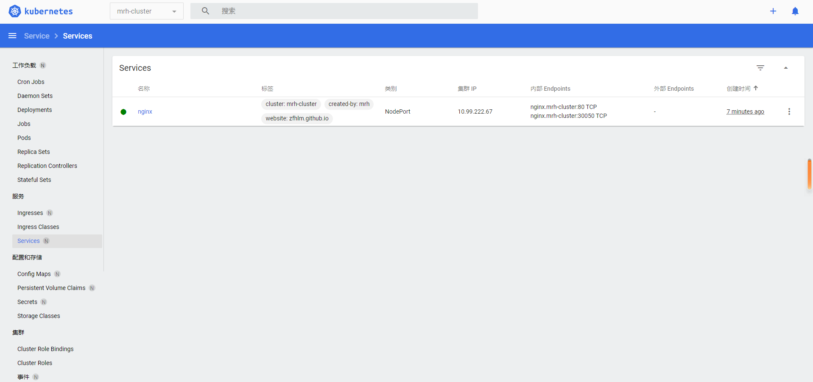
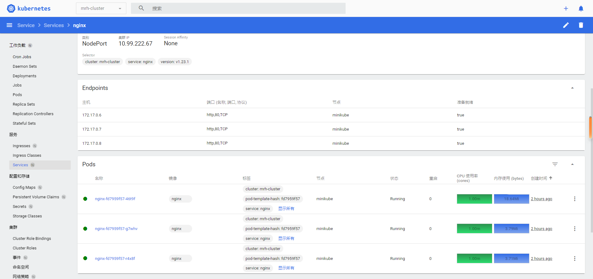
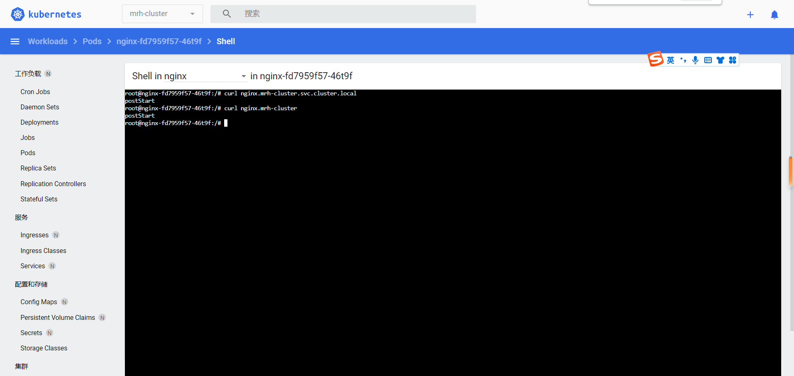
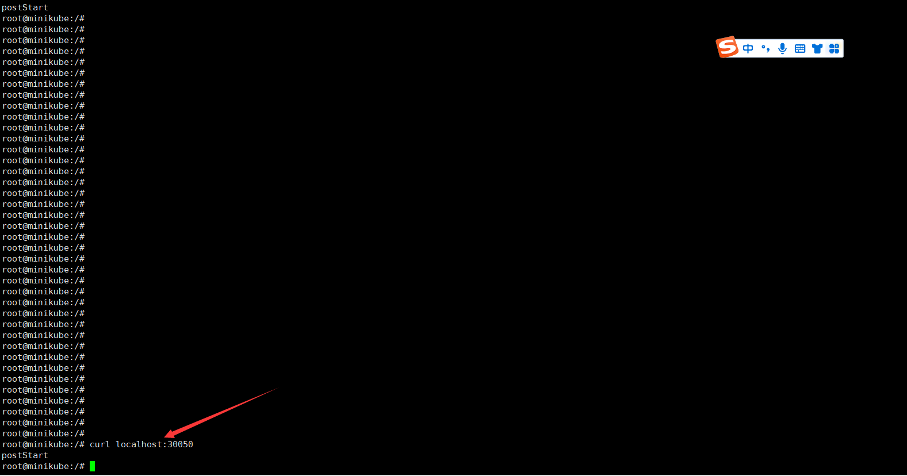
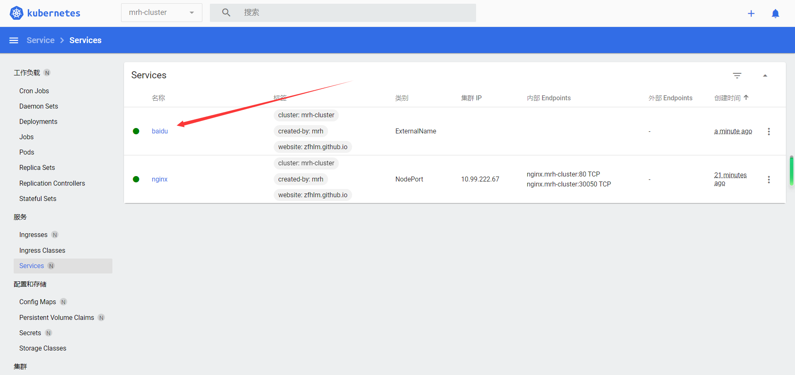
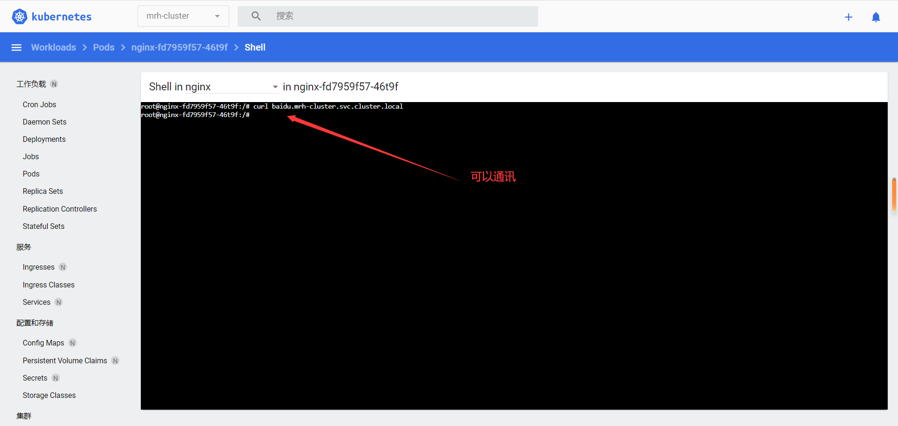

# Kubernetes 服务资源

  * 官方文档：

        https://kubernetes.io/docs/home/

        https://kubernetes.io/docs/reference/kubernetes-api/service-resources/

        https://kubernetes.io/docs/concepts/services-networking/

  * 常用资源：

        Service                                 # 抽象服务

        Endpoints                               # 网络端点集

        EndpointSlice                           # 网络端点切片

        Ingress                                 # 集群网络入口

## Service

  * 简单介绍：

        Service 用于提供负载均衡和服务自动发现，并提供稳定的访问地址（因为 Pod 地址不确定，且随时可能发生变化）

        注意，集群内部可以使用 <service-name>.<cluster-name>.svc.cluster.local 作为 host 访问 Service 提供的服务

  * Service 有四种类型：

        ClusterIP                               # 通过集群的内部 IP 暴露服务，默认类型，只能在集群内部访问

        NodePort                                # 通过集群的每个 Node 上的 IP 和 port 暴露服务，可以对外访问

        LoadBalancer                            # 使用云提供商（第三方例如阿里云、腾讯云付费 k8s 集群）的负载均衡器向外部暴露服务，可以对外访问

        ExternalName                            # 将指定的域名或 IP 地址暴露为服务，只能在集群内部访问

  * 文档地址：

        https://kubernetes.io/docs/concepts/services-networking/service/

        https://kubernetes.io/docs/reference/kubernetes-api/service-resources/service-v1/

        https://kubernetes.io/docs/reference/generated/kubernetes-api/v1.24/#service-v1-core

## Service ClusterIP

  * 创建 nginx Deployment 用于测试：

        (略)

  * 配置示例：

        apiVersion: v1
        kind: Service
        metadata:
          name: nginx
          namespace: mrh-cluster
          # Service 标签
          labels:
            cluster: mrh-cluster
            created-by: mrh
            website: zfhlm.github.io
        spec:
          # Service 类型
          type: ClusterIP
          # Service 暴露端口
          ports:
          - name: http
            port: 80
            targetPort: 80
          # 标签选择器，选择拥有指定 Label 的 Pod 对象集
          selector:
            cluster: mrh-cluster
            service: nginx
            version: v1.23.1

  * 控制台查看创建的 Service 服务：

      

      

  * 集群内部访问 Service 服务：

      

## Service NodePort

  * 创建 nginx Deployment 用于测试：

        (略)

  * 配置示例：

        apiVersion: v1
        kind: Service
        metadata:
          name: nginx
          namespace: mrh-cluster
          labels:
            cluster: mrh-cluster
            created-by: mrh
            website: zfhlm.github.io
        spec:
          type: NodePort
          ports:
          - name: http
            port: 80
            targetPort: 80
            # 暴露到宿主机端口，范围必须 30000-32767，不指定则随机使用一个端口
            nodePort: 30050
          selector:
            cluster: mrh-cluster
            service: nginx
            version: v1.23.1

  * 控制台查看创建的 Service 服务：

      

      

  * 集群内部访问 Service 服务：

      

  * 宿主机访问 Service 服务：

      

      

## Service ExternalName

  * 配置示例，以百度首页为例：

        apiVersion: v1
        kind: Service
        metadata:
          name: baidu
          namespace: mrh-cluster
          labels:
            cluster: mrh-cluster
            created-by: mrh
            website: zfhlm.github.io
        spec:
          type: ExternalName
          externalName: www.baidu.com

  * 控制台查看创建的 Service 服务：

      

      

  * 集群内部访问 Service 服务：

      

## Endpoints 和 EndpointSlice

  * Endpoints 和 EndpointSlice 区别：

        两者都可以用于代理 endpoint 集合，一般配合 Service 资源对象进行使用

        Endpoints 在端点集过多的时候有性能问题，新版本默认使用的都是 EndpointSlice

        Service 类型为 ClusterIP 或 NodePort 时，自动创建相应的 endpoint 集合 (前面截图可见)

  * 文档地址：

        https://kubernetes.io/docs/concepts/services-networking/endpoint-slices/

        https://kubernetes.io/docs/reference/kubernetes-api/service-resources/endpoint-slice-v1/

        https://kubernetes.io/docs/reference/generated/kubernetes-api/v1.24/#endpointslice-v1-discovery-k8s-io

  * 注意，一般不直接创建 Endpoints/EndpointSlice，除非使用下面的 Headless Service 无头服务

## Headless Service
