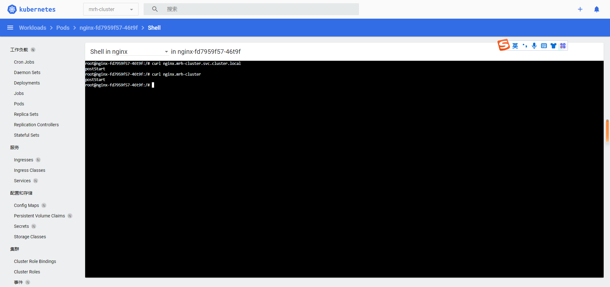
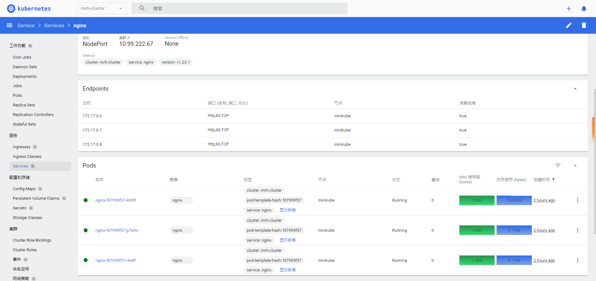
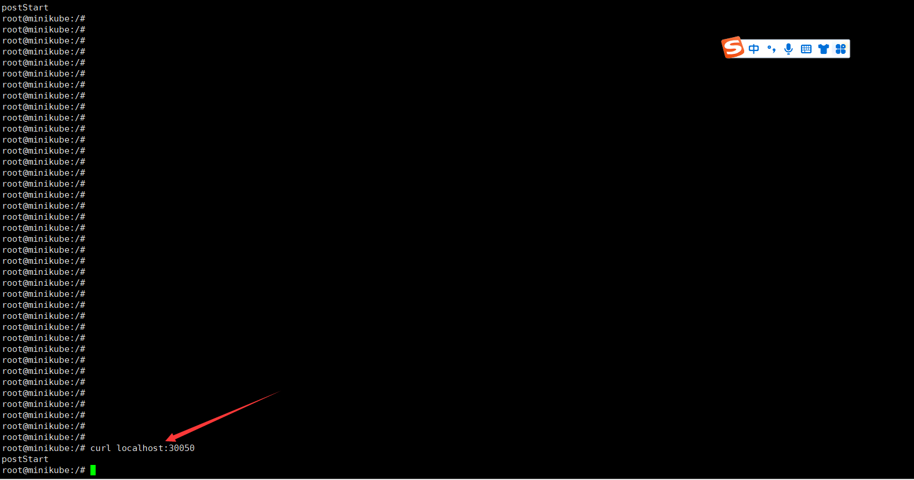
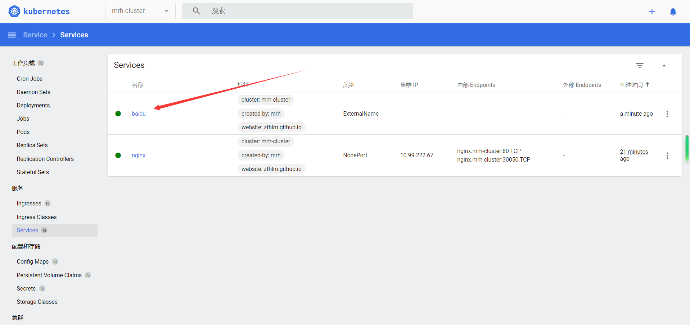
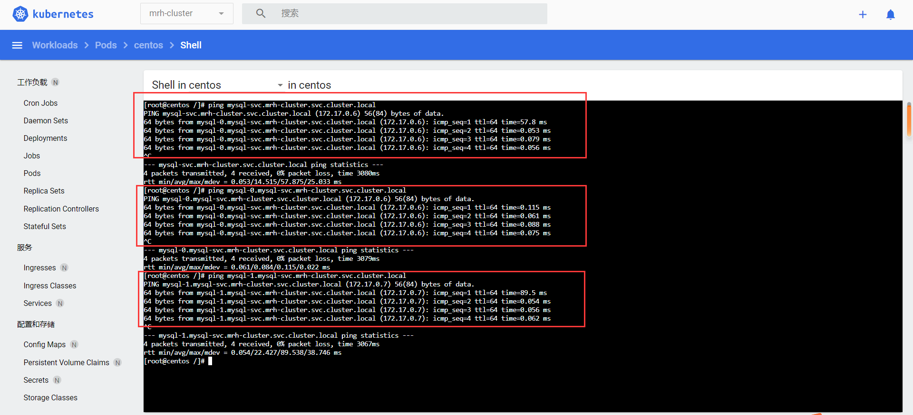
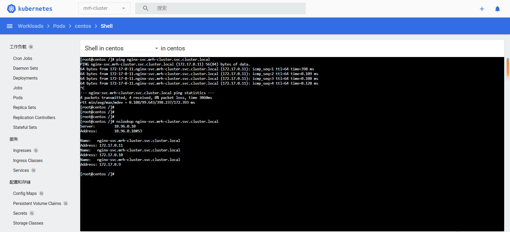

# Kubernetes 服务资源

  * 官方文档：

        https://kubernetes.io/docs/home/

        https://kubernetes.io/docs/reference/kubernetes-api/service-resources/

        https://kubernetes.io/docs/concepts/services-networking/

  * 常用资源：

        Service                                 # 抽象服务

        Endpoints                               # 网络端点集

        EndpointSlice                           # 网络端点切片

        Ingress                                 # 集群网络入口

## Service

  * Service 简单介绍：

        Service 用于提供负载均衡和服务自动发现，并提供稳定的访问地址（因为 Pod 地址不确定，且随时可能发生变化）

        注意，集群内部可以使用 <service-name>.<cluster-name>.svc.cluster.local 作为 host 访问 Service 提供的服务

  * Service 四种类型：

        ClusterIP                               # 通过集群的内部 IP 暴露服务，默认类型，只能在集群内部访问

        NodePort                                # 通过集群的每个 Node 上的 IP 和 port 暴露服务，可以对外访问

        LoadBalancer                            # 使用云提供商（第三方例如阿里云、腾讯云付费 k8s 集群）的负载均衡器向外部暴露服务，可以对外访问

        ExternalName                            # 将指定的域名或 IP 地址暴露为服务，只能在集群内部访问

  * Service 文档地址：

        https://kubernetes.io/docs/concepts/services-networking/service/

        https://kubernetes.io/docs/reference/kubernetes-api/service-resources/service-v1/

        https://kubernetes.io/docs/reference/generated/kubernetes-api/v1.24/#service-v1-core

## Service — ClusterIP

  * 配置示例：

        apiVersion: apps/v1
        kind: Deployment
        metadata:
          name: nginx
          namespace: mrh-cluster
          labels:
            cluster: mrh-cluster
            created-by: mrh
            website: zfhlm.github.io
        spec:
          replicas: 3
          strategy:
            type: RollingUpdate
            rollingUpdate:
              maxSurge: 0
              maxUnavailable: 1
          revisionHistoryLimit: 5
          selector:
            matchLabels:
              cluster: mrh-cluster
              service: nginx
              version: v1.23.1
          template:
            metadata:
              labels:
                cluster: mrh-cluster
                service: nginx
                version: v1.23.1
            spec:
              restartPolicy: Always
              containers:
              - name: nginx
                image: nginx
                imagePullPolicy: Always
                ports:
                - name: http
                  protocol: TCP
                  containerPort: 80
                lifecycle:
                  postStart:
                    exec:
                      command: ['/bin/sh', '-c', 'echo postStart > /usr/share/nginx/html/index.html']
                  preStop:
                    exec:
                      command: ['/bin/sh', '-c', 'echo preStop > /usr/share/nginx/html/index.html']
        --------------------------------------------------------
        apiVersion: v1
        kind: Service
        metadata:
          name: nginx
          namespace: mrh-cluster
          # Service 标签
          labels:
            cluster: mrh-cluster
            created-by: mrh
            website: zfhlm.github.io
        spec:
          # Service 类型
          type: ClusterIP
          # Service 暴露端口
          ports:
          - name: http
            port: 80
            targetPort: 80
          # 标签选择器，选择拥有指定 Label 的 Pod 对象集
          selector:
            cluster: mrh-cluster
            service: nginx
            version: v1.23.1

  * 控制台查看创建的 Service 服务：

      

      

  * 集群内部访问 Service 服务：

      

## Service — NodePort

  * 配置示例：

        apiVersion: apps/v1
        kind: Deployment
        metadata:
          name: nginx
          namespace: mrh-cluster
          labels:
            cluster: mrh-cluster
            created-by: mrh
            website: zfhlm.github.io
        spec:
          replicas: 3
          strategy:
            type: RollingUpdate
            rollingUpdate:
              maxSurge: 0
              maxUnavailable: 1
          revisionHistoryLimit: 5
          selector:
            matchLabels:
              cluster: mrh-cluster
              service: nginx
              version: v1.23.1
          template:
            metadata:
              labels:
                cluster: mrh-cluster
                service: nginx
                version: v1.23.1
            spec:
              restartPolicy: Always
              containers:
              - name: nginx
                image: nginx
                imagePullPolicy: Always
                ports:
                - name: http
                  protocol: TCP
                  containerPort: 80
                lifecycle:
                  postStart:
                    exec:
                      command: ['/bin/sh', '-c', 'echo postStart > /usr/share/nginx/html/index.html']
                  preStop:
                    exec:
                      command: ['/bin/sh', '-c', 'echo preStop > /usr/share/nginx/html/index.html']
        --------------------------------------------------------
        apiVersion: v1
        kind: Service
        metadata:
          name: nginx
          namespace: mrh-cluster
          labels:
            cluster: mrh-cluster
            created-by: mrh
            website: zfhlm.github.io
        spec:
          type: NodePort
          ports:
          - name: http
            port: 80
            targetPort: 80
            # 暴露到宿主机端口，范围必须 30000-32767，不指定则随机使用一个端口
            nodePort: 30050
          selector:
            cluster: mrh-cluster
            service: nginx
            version: v1.23.1

  * 控制台查看创建的 Service 服务：

      

      

  * 集群内部访问 Service 服务：

      

  * 宿主机访问 Service 服务：

      

      

## Service — ExternalName

  * 配置示例，以百度首页为例：

        apiVersion: v1
        kind: Service
        metadata:
          name: baidu
          namespace: mrh-cluster
          labels:
            cluster: mrh-cluster
            created-by: mrh
            website: zfhlm.github.io
        spec:
          type: ExternalName
          externalName: www.baidu.com

  * 控制台查看创建的 Service 服务：

      

      

  * 集群内部访问 Service 服务：

      

## Service — Headless

  * 简单介绍：

        Headless Service 不分配 clusterIP，可以通过解析 Service DNS 返回所有 Pod 的 IP 和 DNS

        Headless Service 可用于配合 StatefulSet 给每个 Pod 分配一个稳定的 DNS，或用于绕开 K8S 集群的负载均衡

  * 文档地址：

        https://kubernetes.io/docs/concepts/services-networking/service/#headless-services

  * Headless Service + StatefulSet 对象配置示例（创建 MySQL StatefulSet 参考 [Kubernetes 工作负载资源##StatefulSet] ）：

        apiVersion: apps/v1
        kind: StatefulSet
        metadata:
          name: mysql
          namespace: mrh-cluster
          labels:
            cluster: mrh-cluster
            created-by: mrh
            website: zfhlm.github.io
        spec:
          replicas: 2
          revisionHistoryLimit: 5
          updateStrategy:
            type: RollingUpdate
            rollingUpdate:
              partition: 0
          selector:
            matchLabels:
              cluster: mrh-cluster
              service: mysql
              version: 5.7.39
          template:
            metadata:
              labels:
                cluster: mrh-cluster
                service: mysql
                version: 5.7.39
            spec:
              restartPolicy: Always
              containers:
              - name: mysql
                image: mysql:5.7.39
                imagePullPolicy: IfNotPresent
                env:
                - name: MYSQL_ROOT_PASSWORD
                  value: '123456'
                ports:
                - name: http
                  protocol: TCP
                  containerPort: 3306
                resources:
                  requests:
                    cpu: 0.2
                    memory: 128M
                  limits:
                    cpu: 0.4
                    memory: 256M
                readinessProbe:
                  initialDelaySeconds: 20
                  periodSeconds: 10
                  timeoutSeconds: 2
                  exec:
                    command: ['/bin/sh', '-c', 'mysqladmin ping -uroot -p123456']
                livenessProbe:
                  initialDelaySeconds: 60
                  timeoutSeconds: 2
                  periodSeconds: 15
                  exec:
                    command: ['/bin/sh', '-c', 'mysqladmin ping -uroot -p123456']
        --------------------------------------------------------
        apiVersion: v1
        kind: Service
        metadata:
          name: mysql-svc
          namespace: mrh-cluster
          labels:
            cluster: mrh-cluster
            created-by: mrh
            website: zfhlm.github.io
        spec:
          ports:
          - name: http
            port: 3306
            targetPort: 3306
          clusterIP: None
          selector:
            cluster: mrh-cluster
            service: mysql
            version: 5.7.39

      除了 Service 本身的 hostname，还会为每个 Pod 分配单独的 hostname

        mysql-svc.mrh-cluster.svc.cluster.local

        mysql-0.mysql-svc.mrh-cluster.svc.cluster.local

        mysql-1.mysql-svc.mrh-cluster.svc.cluster.local

      

  * Headless Service + Deployment 对象配置示例：

        apiVersion: apps/v1
        kind: Deployment
        metadata:
          name: nginx
          namespace: mrh-cluster
          labels:
            cluster: mrh-cluster
            created-by: mrh
            website: zfhlm.github.io
        spec:
          replicas: 3
          strategy:
            type: RollingUpdate
            rollingUpdate:
              maxSurge: 0
              maxUnavailable: 1
          revisionHistoryLimit: 5
          selector:
            matchLabels:
              cluster: mrh-cluster
              service: nginx
              version: v1.23.1
          template:
            metadata:
              labels:
                cluster: mrh-cluster
                service: nginx
                version: v1.23.1
            spec:
              restartPolicy: Always
              containers:
              - name: nginx
                image: nginx
                imagePullPolicy: Always
                ports:
                - name: http
                  protocol: TCP
                  containerPort: 80
        --------------------------------------------------------
        apiVersion: v1
        kind: Service
        metadata:
          name: nginx-svc
          namespace: mrh-cluster
          labels:
            cluster: mrh-cluster
            created-by: mrh
            website: zfhlm.github.io
        spec:
          ports:
          - name: http
            port: 80
            targetPort: 80
          clusterIP: None
          selector:
            cluster: mrh-cluster
            service: nginx
            version: v1.23.1

      这种方式适合例如微服务注册信息的查找，分配给 Pod 的 hostname 无太大意义

      

## Endpoints & EndpointSlice

  * Endpoints 和 EndpointSlice 区别：

        Endpoints 在端点集过多的时候有性能问题，新版本默认使用的都是 EndpointSlice

        Running 状态 Pod 都有自己的 Endpoint，Service 根据 selector 筛选符合条件的 Endpoint 加入到与自身同名的 Endpoints/EndpointSlice

        注意，一般不直接使用 Endpoints/EndpointSlice，由 Service 创建和管理即可

  * 文档地址：

        https://kubernetes.io/docs/concepts/services-networking/endpoint-slices/

        https://kubernetes.io/docs/reference/kubernetes-api/service-resources/endpoint-slice-v1/

        https://kubernetes.io/docs/reference/generated/kubernetes-api/v1.24/#endpointslice-v1-discovery-k8s-io

## Ingress

  * 简单介绍：

        Ingress 作为集群的流量入口，用于路由的转发，方便统一管理，本质上是基于 NodePort 的 Service

        其他替代方案，自定义 NodePort Service，或者使用云服务商提供的 Service LoadBalancer 收费服务

        常见的 Ingress 实现：Kubernetes Ingress、Nginx Ingress、Kong Ingress、HAProxy Ingress

        以下实现使用 Nginx Ingress，由 Nginx 官方开源的 Ingress

  * 为什么要使用

        Ingress Nginx 本质上是一个使用 NodePort 的 Nginx

        微服务集群，通常只有 gateway 需要暴露到集群外部访问，也可以使用 NodePort 方式进行多宿主机暴露

        但是，Ingress Nginx 并发支撑度大，能大大减少 NodePort 宿主机的数量，方便进行管理。

  * 文档地址：

        https://kubernetes.io/docs/concepts/services-networking/ingress/

        https://kubernetes.io/docs/reference/kubernetes-api/service-resources/ingress-v1/

        https://kubernetes.io/docs/reference/generated/kubernetes-api/v1.24/#ingress-v1-networking-k8s-io

        https://github.com/kubernetes/ingress-nginx/releases

  * 先初始化 Ingress Nginx 资源：

        wget -o ingress-controller-v1.2.1.tar.gz https://github.com/kubernetes/ingress-nginx/archive/refs/tags/controller-v1.2.1.tar.gz

        tar -zxvf ingress-controller-v1.2.1.tar.gz

        cp ingress-nginx-controller-v1.2.1/deploy/static/provider/baremetal/deploy.yaml ./ingress-nginx-deploy.yaml

        # 自定义配置
        vi ingress-nginx-deploy.yaml

        => (固定端口号，方便外部进行映射)

            apiVersion: v1
            kind: Service
            ...
                ...
                # http 端口固定为 30080
                nodePort: 30080
                ...
                # https 端口固定为 30443
                nodePort: 30443
              ...
              type: NodePort

        => (固定运行 Node 节点，高可用集群)

            apiVersion: apps/v1
            kind: Deployment
            ...
              ...
              # 副本数，根据运行 Ingress Nginx 的 Node 个数更改
              replicas: 3
              ...
              # 根据 Label 选择运行节点，配置之前需要给 Node 添加 Label
              nodeSelector:
                kubernetes.io/ingress-node: ''

        # 拉取出现错误，可替换为国内镜像源，或使用 VPN 工具
        kubectl deploy -f ingress-nginx-deploy.yaml

  * Ingress Nginx 配置示例：

        apiVersion: apps/v1
        kind: Deployment
        metadata:
          name: tomcat
          namespace: mrh-cluster
          labels:
            cluster: mrh-cluster
            created-by: mrh
            website: zfhlm.github.io
        spec:
          replicas: 2
          strategy:
            type: RollingUpdate
            rollingUpdate:
              maxSurge: 0
              maxUnavailable: 1
          revisionHistoryLimit: 5
          selector:
            matchLabels:
              cluster: mrh-cluster
              service: tomcat
          template:
            metadata:
              labels:
                cluster: mrh-cluster
                service: tomcat
            spec:
              containers:
              - name: tomcat
                image: tomcat
                ports:
                - containerPort: 8080
                lifecycle:
                  postStart:
                    exec:
                      command: ['/bin/sh', '-c', 'mkdir -p /usr/local/tomcat/webapps/ROOT && echo hello > /usr/local/tomcat/webapps/ROOT/index.html']
        ---------------------------------------
        apiVersion: v1
        kind: Service
        metadata:
          name: tomcat-svc
          namespace: mrh-cluster
          labels:
            cluster: mrh-cluster
            created-by: mrh
            website: zfhlm.github.io
        spec:
          type: ClusterIP
          ports:
          - name: http
            port: 8080
            targetPort: 8080
          selector:
            cluster: mrh-cluster
            service: tomcat
        ---------------------------------------
        apiVersion: networking.k8s.io/v1
        kind: Ingress
        metadata:
          name: tomcat-ingress
          namespace: mrh-cluster
          labels:
            cluster: mrh-cluster
            created-by: mrh
            website: zfhlm.github.io
        spec:
          ingressClassName: nginx
          rules:
            - http:
                paths:
                - path: /
                  pathType: 'Prefix'
                  backend:
                    service:
                      name: tomcat-svc
                      port:
                        number: 8080

  * Ingress 资源对象发布后，使用 Node 节点地址进行访问：

        http://node-ip:30080/
