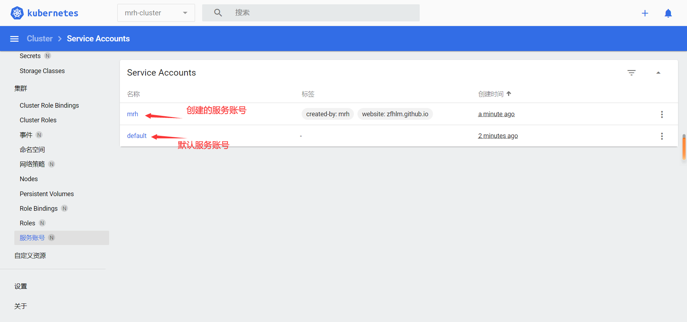
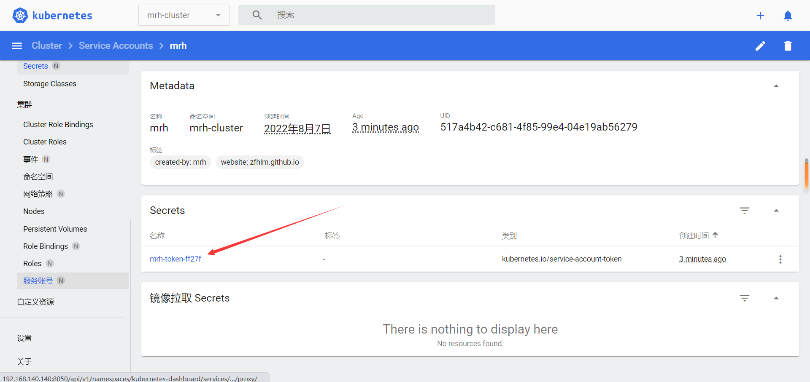
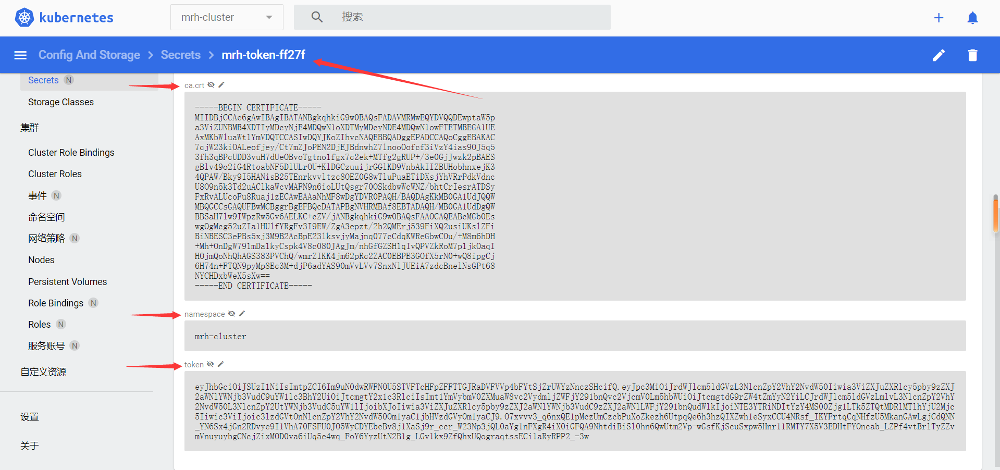

# Kubernetes 身份认证资源

  * 官方文档：

        https://kubernetes.io/docs/home/

        https://kubernetes.io/docs/concepts/security/

        https://kubernetes.io/docs/reference/kubernetes-api/authentication-resources/

        https://kubernetes.io/docs/reference/generated/kubernetes-api/v1.24/

  * 资源介绍：

        ServiceAccount                  # 集群服务账号，通常用于 Pod 访问集群 API，命名空间下默认存在 default 服务账号，一般不需要自己创建

        //TokenRequest                  # 令牌申请请求，为给定的服务账号请求一个令牌

        //TokenReview                   # 令牌审查，用于通过验证令牌来确认已知用户

        //CertificateSigningRequest     # 证书签名请求，用于异步批准和颁发 x509 证书

## ServiceAccount

  * 配置示例：

        apiVersion: v1
        kind: ServiceAccount
        metadata:
          name: mrh
          namespace: mrh-cluster
          labels:
            created-by: mrh
            website: zfhlm.github.io

  * 查看已创建服务账号：

      

      

      

  * 服务账号 Pod 使用示例：

        apiVersion: v1
        kind: Pod
        metadata:
          name: centos
          namespace: mrh-cluster
          labels:
            cluster: mrh-cluster
            service: centos
            created-by: mrh
            website: zfhlm.github.io
        spec:
          restartPolicy: Always
          # 指定服务账号
          serviceAccountName: mrh
          containers:
          - name: centos
            image: centos:centos7
            imagePullPolicy: IfNotPresent
            command: ['/bin/sh', '-c', '/usr/sbin/init']
